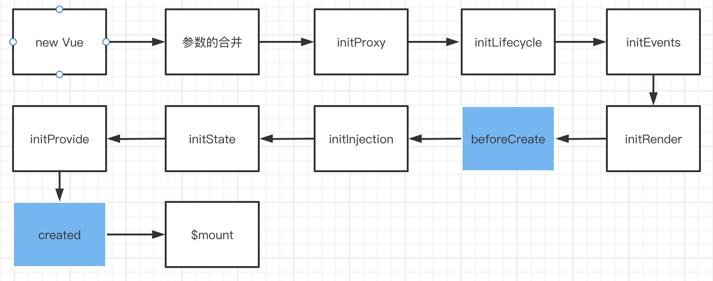

# Vue 实例挂载

> 程序的初始化来源于 `new Vue({...})`，创建一个 Vue 实例发生了什么，对应 Vue 官方文档 https://cn.vuejs.org/v2/guide/instance.html 这一节

## 1、生命周期

<!--  -->

从生命周期中看，实例挂载主要是从 `new Vue()` 到`mounted`钩子函数触发的过程：

- 初始化事件机制 和 生命周期
- 触发 `beforeCreate` hook
- 初始化注入 和 数据响应式
- 触发 `created` hook
- 编译模板生成 Vnode
- 触发 `beforeMount` hook
- 挂载节点到根节点
- 触发 `mounted` hook

## 2、new Vue

```js
function Vue(options) {
  if (!(this instanceof Vue)) {
    warn("Vue is a constructor and should be called with the `new` keyword");
  }
  this._init(options);
}
```

`!(this instanceof Vue)`来判断当前是否是通过`new`关键字来调用 Vue，同样也可以通过 es6 新引入的`new.target === Vue`来判断。

## 3、Vue.prototype.\_init 函数大概

```js
Vue.prototype._init = function(options) {
  var vm = this;
  // 当前组件的uid，升序自增；当使用 devlopment的performance，使用uid来mark;在transtion.js中也有应用
  vm._uid = uid$3++;
  // 这里会有一个 init 的 性能监控 starttag
  // 运行_init会将当前字段标记为true,通过此属性来避免vm的响应式观察当前对象，比如在set 函数里面传入一个 vm
  vm._isVue = true;
  // merge options
  if (options && options._isComponent) {
    initInternalComponent(vm, options);
  } else {
    // 实例的挂载会走进这个语句块中
    // $options 合并了来自于父级的options
    vm.$options = mergeOptions(
      resolveConstructorOptions(vm.constructor),
      options || {},
      vm
    );
  }
  // 初始化代理
  initProxy(vm);
  // expose real self
  vm._self = vm;
  // 初始化生命周期
  initLifecycle(vm);
  // 初始化事件
  initEvents(vm);
  // 初始化渲染
  initRender(vm);
  // 触发 hook beforeCreate
  callHook(vm, "beforeCreate");
  // 1.注入
  initInjections(vm); // resolve injections before data/props
  // 2.初始化prop、data、methods、computed、watch
  initState(vm);
  // 3.提供者
  initProvide(vm); // resolve provide after data/props
  // 触发 hook created
  callHook(vm, "created");
  // 这里会有一个 init 的 性能监控 endtag
  // 如果提供el那么挂载
  if (vm.$options.el) {
    vm.$mount(vm.$options.el);
  }
```


