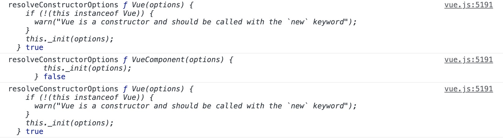

# Vue 实例挂载

> 程序的初始化来源于 `new Vue({...})`，创建一个 Vue 实例发生了什么，对应 Vue 官方文档 https://cn.vuejs.org/v2/guide/instance.html 这一节

## 1、生命周期

<!--  -->

从生命周期中看，实例挂载主要是从 `new Vue()` 到`mounted`钩子函数触发的过程：

- 初始化事件机制 和 生命周期
- 触发 `beforeCreate` hook
- 初始化注入 和 数据响应式
- 触发 `created` hook
- 编译模板生成 Vnode
- 触发 `beforeMount` hook
- 挂载节点到根节点
- 触发 `mounted` hook

## 2、new Vue

```js
function Vue(options) {
  if (!(this instanceof Vue)) {
    warn("Vue is a constructor and should be called with the `new` keyword");
  }
  this._init(options);
}
```

`!(this instanceof Vue)`来判断当前是否是通过`new`关键字来调用 Vue，同样也可以通过 es6 新引入的`new.target === Vue`来判断。

## 3、Vue.prototype.\_init 函数大概

```js
Vue.prototype._init = function(options) {
  var vm = this;
  // 当前组件的uid，升序自增；当使用 devlopment的performance，使用uid来mark;在transtion.js中也有应用
  vm._uid = uid$3++;
  // 这里会有一个 init 的 性能监控 starttag
  // 运行_init会将当前字段标记为true,通过此属性来避免vm的响应式观察当前对象，比如在set 函数里面传入一个 vm
  vm._isVue = true;
  // merge options
  if (options && options._isComponent) {
    initInternalComponent(vm, options);
  } else {
    // 实例的挂载会走进这个语句块中
    // $options 合并了来自于父级的options
    vm.$options = mergeOptions(
      resolveConstructorOptions(vm.constructor),
      options || {},
      vm
    );
  }
  // 初始化代理
  initProxy(vm);
  // expose real self
  vm._self = vm;
  // 初始化生命周期
  initLifecycle(vm);
  // 初始化事件
  initEvents(vm);
  // 初始化渲染
  initRender(vm);
  // 触发 hook beforeCreate
  callHook(vm, "beforeCreate");
  // 1.注入
  initInjections(vm); // resolve injections before data/props
  // 2.初始化prop、data、methods、computed、watch
  initState(vm);
  // 3.提供者
  initProvide(vm); // resolve provide after data/props
  // 触发 hook created
  callHook(vm, "created");
  // 这里会有一个 init 的 性能监控 endtag
  // 如果提供el那么挂载
  if (vm.$options.el) {
    vm.$mount(vm.$options.el);
  }
```


### 3.1、参数合并

> 合并父级参数

```js
vm.$options = mergeOptions(
  resolveConstructorOptions(vm.constructor),
  options || {},
  vm
);
```

几个重要的函数

- resolveConstructorOptions
- resolveModifiedOptions
- extend
- mergeOptions
- normalizeProps
- normalizeInject
- normalizeDirectives

由于在 `mergeOptions` 函数首先调用 `resolveConstructorOptions`，所以先来分析 `resolveConstructorOptions`

#### resolveConstructorOptions

> resolveConstructorOptions(Ctor: Vue | VueComponent): VueOptions

```js
resolveConstructorOptions(vm.constructor);
```

```js
function resolveConstructorOptions(Ctor) {
  // 查看入参类型
  console.log("resolveConstructorOptions", Ctor, Ctor === Vue);
  var options = Ctor.options;
  // 如果存在super，针对于VueComponent，查找Vue的options
  if (Ctor.super) {
    // 获取父级属性
    var superOptions = resolveConstructorOptions(Ctor.super);
    var cachedSuperOptions = Ctor.superOptions;
    // 构造函数上缓存的选项 和 父级构造函数的选项是否一致，如果不一致，更新为新的父级的属性，这里是校验的引用
    if (superOptions !== cachedSuperOptions) {
      // super option changed,
      // need to resolve new options.
      Ctor.superOptions = superOptions;
      // check if there are any late-modified/attached options (#4976)
      var modifiedOptions = resolveModifiedOptions(Ctor);
      // update base extend options
      if (modifiedOptions) {
        extend(Ctor.extendOptions, modifiedOptions);
      }
      options = Ctor.options = mergeOptions(superOptions, Ctor.extendOptions);
      if (options.name) {
        options.components[options.name] = Ctor;
      }
    }
  }
  return options;
}
```

##### 入参的类型：

`resolveConstructorOptions`传入参数为实例构造函数 `Vue` 或者 `VueComponent`，`vm.constructor`访问当前实例的 `constructor`，会查找原型链的`constructor`，所以指向了 Vue 或者 VueComponent；因此实例挂载时`resolveConstructorOptions`的入参为`Vue`，加载子组件时参数合并的入参是`VueComponent`。

初始化一个只有一个组件的 Vue 实例：

```js
function resolveConstructorOptions(Ctor) {
  // 查看入参类型
  console.log("resolveConstructorOptions", Ctor, Ctor === Vue);
}
```



第一个打印是 `new Vue` 的参数合并，第二次打印是子组件 `Vue.extend`触发的参数合并，
`Vue.extend`会构造一个特殊的`VueComponent`构造函数返回，并且会维护`VueComponent`的`super`属性；特殊性表现在多次传入相同的 options 只会复用一套构造函数；因此并不是 Vue；第三次打印的是`resolveConstructorOptions`函数中，子组件构造函数的 super 属性走进了条件判断，去获取 super 的属性再次调用 `resolveConstructorOptions`。入参为`vue`

##### `Ctor.options`

实例初始化时，`Vue.options`的维护在于`initGlobalAPI`函数 和 其他几条语句：

- 添加组件，指令，过滤器集合
- 添加内建组件 `KeepAlive`
- 添加过渡组件 `Transition`，`TransitionGroup`
- 添加指令 `model`，`show`
- 添加了\_base 属性指向 Vue

```js
var builtInComponents = {
  KeepAlive: KeepAlive,
};
var ASSET_TYPES = ["component", "directive", "filter"];
function initGlobalAPI(Vue) {
  // ...
  Vue.options = Object.create(null);
  ASSET_TYPES.forEach(function(type) {
    Vue.options[type + "s"] = Object.create(null);
  });
  Vue.options._base = Vue;
  extend(Vue.options.components, builtInComponents);
  // ...
}
var platformComponents = {
  Transition: Transition,
  TransitionGroup: TransitionGroup,
};
var platformDirectives = {
  model: directive,
  show: show,
};
// install platform runtime directives & components
extend(Vue.options.directives, platformDirectives);
extend(Vue.options.components, platformComponents);
```
