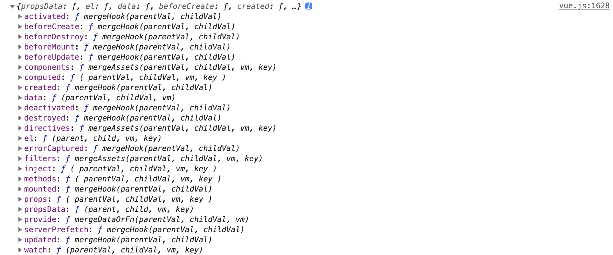

# 参数合并

> 合并父级参数

```js
if (options && options._isComponent) {
  initInternalComponent(vm, options);
} else {
  // 实例的挂载会走进这个语句块中
  // $options 合并了来自于父级的options
  vm.$options = mergeOptions(
    resolveConstructorOptions(vm.constructor),
    options || {},
    vm
  );
}
```

几个重要的函数

- mergeOptions
  - resolveConstructorOptions
    - resolveModifiedOptions
  - normalizeProps
  - normalizeInject
  - normalizeDirectives
  - mergeField

由于在 `mergeOptions` 首先调用函数 `resolveConstructorOptions`，所以先来分析 `resolveConstructorOptions`

## 1、resolveConstructorOptions

> resolveConstructorOptions(Ctor: Vue | VueComponent): VueOptions

```js
resolveConstructorOptions(vm.constructor);

function resolveConstructorOptions(Ctor) {
  // 查看入参类型
  console.log("resolveConstructorOptions", Ctor.name, Ctor === Vue);
  var options = Ctor.options;
  // 如果存在super，针对于VueComponent，查找Vue的options
  if (Ctor.super) {
    // 获取父级属性
    var superOptions = resolveConstructorOptions(Ctor.super);
    var cachedSuperOptions = Ctor.superOptions;
    // 构造函数上缓存的选项 和 父级构造函数的选项是否一致，如果不一致，更新为新的父级的属性，这里是校验的引用
    if (superOptions !== cachedSuperOptions) {
      // super option changed,
      // need to resolve new options.
      Ctor.superOptions = superOptions;
      // check if there are any late-modified/attached options (#4976)
      // 找出变更的选项，针对于VueComponent
      var modifiedOptions = resolveModifiedOptions(Ctor);
      // update base extend options
      // 如果发现存在变更的选项，那么进行更新
      if (modifiedOptions) {
        extend(Ctor.extendOptions, modifiedOptions);
      }
      // 重新merge选项
      options = Ctor.options = mergeOptions(superOptions, Ctor.extendOptions);
      // 如果存在 name 属性
      if (options.name) {
        options.components[options.name] = Ctor;
      }
    }
  }
  return options;
}
```

### 1.1、入参的类型：

`resolveConstructorOptions`传入参数为构造函数 `Vue` 或者 `VueComponent`；`mergeOptions`调用`resolveConstructorOptions(vm.constructor)`，`vm.constructor`访问当前实例的 `constructor`，实例上不存在，会继续查找到原型链的`constructor`，所以指向了 `Vue` 或者 `VueComponent`；因此实例挂载时`resolveConstructorOptions`的入参为`Vue`，构建子组件时`Vue.extend`的入参是`VueComponent`。

初始化一个只有一个组件的 Vue 实例：

```js
function resolveConstructorOptions(Ctor) {
  // 查看入参类型
  console.log("resolveConstructorOptions", Ctor.name, Ctor === Vue);
}
// resolveConstructorOptions Vue true
// resolveConstructorOptions VueComponent false
// resolveConstructorOptions Vue true
```

第一个打印是 `new Vue` 时的参数合并，第二次打印是子组件 `Vue.extend`触发的参数合并，
`Vue.extend`会构造一个特殊的`VueComponent`构造函数并返回，内部维护了`VueComponent`的`super`属性；特殊性表现在多次传入相同的 options 对象（引用相同）会读取 options 对象上的缓存`VueComponent`；第三次打印的是`resolveConstructorOptions`函数中，子组件构造函数的 `super` 属性走进了条件判断，去获取`super`的`options`再次调用 `resolveConstructorOptions`，入参为构造函数`Vue`。

### 1.2、`Ctor.options`

Vue 实例初始化时，`Ctor.options`入参`Vue.options`，维护于`initGlobalAPI`函数和其他几条语句：

- 添加组件，指令，过滤器集合
- 添加内建组件 `KeepAlive`
- 添加过渡组件 `Transition`，`TransitionGroup`
- 添加指令 `model`，`show`
- 添加了\_base 属性指向 Vue

```js
var builtInComponents = {
  KeepAlive: KeepAlive,
};
var ASSET_TYPES = ["component", "directive", "filter"];
function initGlobalAPI(Vue) {
  // ...
  Vue.options = Object.create(null);
  ASSET_TYPES.forEach(function(type) {
    Vue.options[type + "s"] = Object.create(null);
  });
  Vue.options._base = Vue;
  extend(Vue.options.components, builtInComponents);
  // ...
}
var platformComponents = {
  Transition: Transition,
  TransitionGroup: TransitionGroup,
};
var platformDirectives = {
  model: directive,
  show: show,
};
// install platform runtime directives & components
extend(Vue.options.directives, platformDirectives);
extend(Vue.options.components, platformComponents);
```

### 1.3、superOptions !== cachedSuperOptions 的场景

下面的 case 会触发这一场景

```js
const mA = Vue.extend({
  data() {
    return { a: "a" };
  },
  name: "m-a",
  template: "<div>{{a}}</div>",
});
Vue.mixin({
  created: function() {},
});
const app = new Vue({
  components: {
    "my-a": mA,
    "my-b": mA,
  },
  data: { a: 1 },
  template: "<main><my-a></my-a><my-b></my-b></main>",
  mounted() {},
}).$mount("#app");
```

首先使用`Vue.extend`创建`Vue`子类`VueComponent`，`VueComponent.superOptions` 是 `Vue.options`；Vue.mixin 调用了`mergeOptions`返回了新的对象，因此走入了这个 case,下面为`Vue.mixin`的代码

```js
Vue.mixin = function(mixin) {
  // mergeOptions 返回一个新的合并对象
  this.options = mergeOptions(this.options, mixin);
  return this;
};
```

进入 superOptions !== cachedSuperOptions 的场景之后，更新自身的 options

```js
function resolveConstructorOptions(Ctor) {
  var superOptions = resolveConstructorOptions(Ctor.super);
  var cachedSuperOptions = Ctor.superOptions;
  console.log(superOptions !== cachedSuperOptions); // output: true
  if (superOptions !== cachedSuperOptions) {
    // super option changed,
    // need to resolve new options.
    // 更新其 superOptions 为最新的值
    Ctor.superOptions = superOptions;
    // check if there are any late-modified/attached options (#4976)
    // 查找变更的属性
    var modifiedOptions = resolveModifiedOptions(Ctor);
    // update base extend options
    if (modifiedOptions) {
      extend(Ctor.extendOptions, modifiedOptions);
    }
    // 重新执行获取当前的options，和在Vue.extend中相同的做法
    options = Ctor.options = mergeOptions(superOptions, Ctor.extendOptions);
    if (options.name) {
      options.components[options.name] = Ctor;
    }
  }
}

// 函数意图找出变更的选项
function resolveModifiedOptions(Ctor) {
  var modified;
  var latest = Ctor.options;
  var sealed = Ctor.sealedOptions;
  for (var key in latest) {
    if (latest[key] !== sealed[key]) {
      if (!modified) {
        modified = {};
      }
      modified[key] = latest[key];
    }
  }
  return modified;
}
```

`sealedOptions`在`Vue.extend`中维护，是构建子类 `VueComponent` 时缓存的最终 `options`

```js
Vue.extend = function(extendOptions) {
  var Sub = function VueComponent(options) {
    this._init(options);
  };
  var Super = this;
  Sub.options = mergeOptions(Super.options, extendOptions);
  Sub.sealedOptions = extend({}, Sub.options);
};
```

## 2、mergeOptions

```js
function mergeOptions(parent, child, vm) {
  {
    checkComponents(child);
  }
  // 如果是一个方法，应该是传入的VueComponent ？
  if (typeof child === "function") {
    child = child.options;
  }
  normalizeProps(child, vm);
  normalizeInject(child, vm);
  normalizeDirectives(child);
  // Apply extends and mixins on the child options,
  // but only if it is a raw options object that isn't
  // the result of another mergeOptions call.
  // Only merged options has the _base property.
  if (!child._base) {
    if (child.extends) {
      parent = mergeOptions(parent, child.extends, vm);
    }
    if (child.mixins) {
      for (var i = 0, l = child.mixins.length; i < l; i++) {
        parent = mergeOptions(parent, child.mixins[i], vm);
      }
    }
  }
  var options = {};
  var key;
  for (key in parent) {
    mergeField(key);
  }
  for (key in child) {
    if (!hasOwn(parent, key)) {
      mergeField(key);
    }
  }
  function mergeField(key) {
    var strat = strats[key] || defaultStrat;
    options[key] = strat(parent[key], child[key], vm, key);
  }
  return options;
}
```

parent 输入为 Vue 或者 VueComponent 的 options，child 为本次实例化的选项

### 2.1、checkComponent 函数

```js
function checkComponents(options) {
  for (var key in options.components) {
    validateComponentName(key);
  }
}
function validateComponentName(name) {
  if (
    !new RegExp("^[a-zA-Z][\\-\\.0-9_" + unicodeRegExp.source + "]*$").test(
      name
    )
  ) {
    warn(
      'Invalid component name: "' +
        name +
        '". Component names ' +
        "should conform to valid custom element name in html5 specification."
    );
  }
  if (isBuiltInTag(name) || config.isReservedTag(name)) {
    warn(
      "Do not use built-in or reserved HTML elements as component " +
        "id: " +
        name
    );
  }
}
```

校验组件的名称是否符合规范，并且组件的名称不能和内建组件、保留的标签名称冲突

### 2.2、normalizeProps 函数

```js
function normalizeProps(options, vm) {
  // props为空直接退出
  var props = options.props;
  if (!props) {
    return;
  }
  var res = {};
  var i, val, name;
  // props: ['','','']
  if (Array.isArray(props)) {
    i = props.length;
    while (i--) {
      val = props[i];
      if (typeof val === "string") {
        name = camelize(val);
        res[name] = { type: null };
      } else {
        warn("props must be strings when using array syntax.");
      }
    }
    // props: {
    a: {
    }
    // }
  } else if (isPlainObject(props)) {
    for (var key in props) {
      val = props[key];
      name = camelize(key);
      res[name] = isPlainObject(val) ? val : { type: val };
    }
  } else {
    warn(
      'Invalid value for option "props": expected an Array or an Object, ' +
        "but got " +
        toRawType(props) +
        ".",
      vm
    );
  }
  options.props = res;
}
```

我们都知道 `options.props` 有两种方式传参：数组和对象，这个函数目的是输出一个标准化格式的 props。当输入的是`string[]`，数据格式化成`{[propName]:{type:null}}`，当输入的是对象，数据格式化为`{[propName]: inputValue }`或者`{[propName]:{ type:inputValue}}。

```js
// 输入为对象时的case
{
  props:{
    a:{
      type:String,
      default:'a'
    }
  }
}
或
{
  props:{
    a: String
  }
}
```

### 2.3、normalizeInject 函数

```js
function normalizeInject(options, vm) {
  // inject为空直接退出
  var inject = options.inject;
  if (!inject) {
    return;
  }
  var normalized = (options.inject = {});
  // 如果是数组
  if (Array.isArray(inject)) {
    for (var i = 0; i < inject.length; i++) {
      normalized[inject[i]] = { from: inject[i] };
    }
    // 如果是对象
  } else if (isPlainObject(inject)) {
    for (var key in inject) {
      var val = inject[key];
      normalized[key] = isPlainObject(val)
        ? extend({ from: key }, val)
        : { from: val };
    }
  } else {
    warn(
      'Invalid value for option "inject": expected an Array or an Object, ' +
        "but got " +
        toRawType(inject) +
        ".",
      vm
    );
  }
}
```

`options.inject`入参为`Array<string>`或者`{ [key: string]: string | Symbol | Object }`

```js
// inject:['a']
options.inject = {
  a: {
    from: "a",
  },
};
// inject:{ a : 'a'} || {a: {form: 'a' ,default: 'a'}}
options.inject = {
  a: { form: "a", default: "a" },
};
options.inject = {
  a: {
    from: "a",
  },
};
```

返回对象都会存在`from`属性，标识着在注入内容中查找这个 key

### 2.3、normalizeDirectives 函数

```js
var dirs = options.directives;
if (dirs) {
  for (var key in dirs) {
    var def$$1 = dirs[key];
    if (typeof def$$1 === "function") {
      dirs[key] = { bind: def$$1, update: def$$1 };
    }
  }
}
```

如果传入的是对象，`bind`，`update`，`unbind`等钩子函数均自定义提供，将不会格式化；如果传入的是函数，那么就将`bind`，`update`都指向这个函数。

### 2.4、在子选项上应用扩展和混合的场景

```js
if (!child._base) {
  if (child.extends) {
    parent = mergeOptions(parent, child.extends, vm);
  }
  if (child.mixins) {
    for (var i = 0, l = child.mixins.length; i < l; i++) {
      parent = mergeOptions(parent, child.mixins[i], vm);
    }
  }
}
```

如何传入的子`options`存在`extends`或者`mixins`，那么子选项上的`extends`或者`mixins`合并`parent`后再作为新的 parent

```js
var options = {
  mixins: [
    {
      created: function() {
        console.log(123);
      },
    },
  ],
};
var Component = Vue.extend(options);
var component = new Component(); // => 123
```

### 2.5、mergeField

```js
var strats = config.optionMergeStrategies;
// 省略 ...
function mergeOptions(parent, child, vm) {
  var options = {};
  var key;
  for (key in parent) {
    mergeField(key);
  }
  for (key in child) {
    if (!hasOwn(parent, key)) {
      mergeField(key);
    }
  }
  function mergeField(key) {
    var strat = strats[key] || defaultStrat;
    options[key] = strat(parent[key], child[key], vm, key);
  }
  return options;
}
```

`config.optionMergeStrategies`：vue 提供的自定义合并策略接口，并且其内置了各种选项默认的合并策略；上面代码的功能是使用相关的合并策略对不同的选项,进行 merge 操作：

- 父选项的属性要全部进行合并
- 子选项中父选项不存在的属性进行合并
- 最终结果返回一个*新的对象*

### 2.6、合并策略

让我们打印下 `config.optionMergeStrategies`



默认的策略：如果传入子选项，那么使用子选项，如果没有，使用父选项

```js
var defaultStrat = function(parentVal, childVal) {
  return childVal === undefined ? parentVal : childVal;
};
```

#### 2.6.1、el、propsData 的合并策略

使用 defaultStrat；如果传入，就直接使用此选项

#### 2.6.2、data、provide 的合并策略

```js
function mergeDataOrFn(parentVal, childVal, vm) {
  // 如果不存在vm
  if (!vm) {
    // in a Vue.extend merge, both should be functions
    // 有父用父，有子用子，如果都提供合并父子
    if (!childVal) {
      return parentVal;
    }
    if (!parentVal) {
      return childVal;
    }
    // when parentVal & childVal are both present,
    // we need to return a function that returns the
    // merged result of both functions... no need to
    // check if parentVal is a function here because
    // it has to be a function to pass previous merges.
    return function mergedDataFn() {
      return mergeData(
        typeof childVal === "function" ? childVal.call(this, this) : childVal,
        typeof parentVal === "function" ? parentVal.call(this, this) : parentVal
      );
    };
  } else {
    return function mergedInstanceDataFn() {
      // instance merge
      var instanceData =
        typeof childVal === "function" ? childVal.call(vm, vm) : childVal;
      var defaultData =
        typeof parentVal === "function" ? parentVal.call(vm, vm) : parentVal;
      if (instanceData) {
        return mergeData(instanceData, defaultData);
      } else {
        return defaultData;
      }
    };
  }
}
strats.provide = mergeDataOrFn;
```

分为两种情况：传入了实例 vm 和没有传入 vm

- 传入实例 vm
  - childVal 存在，mergeData(childVal, parentVal)
  - childVal 不存在，返回 parentVal
- 没有传入 vm
  - childVal 不存在，返回 parentVal
  - parentVal 不存在，返回 childVal
  - 都存在，mergeData(childVal, parentVal)

mergeData 函数

入参 to 为 childVal，from 为 parentVal

```js
function mergeData(to, from) {
  // 如果不存在form数据，直接返回to
  if (!from) {
    return to;
  }
  var key, toVal, fromVal;

  var keys = hasSymbol ? Reflect.ownKeys(from) : Object.keys(from);
  // 把from data的属性作为keys，遍历 keys
  for (var i = 0; i < keys.length; i++) {
    key = keys[i];
    // in case the object is already observed...
    // "__ob__" 是指向Observer的指针
    if (key === "__ob__") {
      continue;
    }
    toVal = to[key];
    fromVal = from[key];
    // 如果to数据没有这个属性，意味着需要添加这个属性到to中
    if (!hasOwn(to, key)) {
      // 建立数据响应式
      set(to, key, fromVal);
    } else if (
      // 此处是数据递归的判断，每个对象都要数据的merge
      toVal !== fromVal &&
      isPlainObject(toVal) &&
      isPlainObject(fromVal)
    ) {
      mergeData(toVal, fromVal);
    }
  }
  return to;
}
```

- 如果 parentVal 不存在，返回 childVal
- parentVal[key]存在，childVal[key]不存在，在 childVal 中构建响应式属性 key

例如我们 `Vue.options.data` = `{all:1}`;那么所有的子组件都会插入一个响应式的`all`属性

#### 2.6.3、hook 的合并策略

```js
function mergeHook(parentVal, childVal) {
  var res = childVal
    ? parentVal
      ? parentVal.concat(childVal)
      : Array.isArray(childVal)
      ? childVal
      : [childVal]
    : parentVal;
  return res ? dedupeHooks(res) : res;
}
function dedupeHooks(hooks) {
  var res = [];
  for (var i = 0; i < hooks.length; i++) {
    // indexOf 使用严格的方式
    if (res.indexOf(hooks[i]) === -1) {
      res.push(hooks[i]);
    }
  }
  return res;
}
```

返回一个 hook 数组，数组内 hook 不重复，父选项 hook 在前，子选项 hook 在后，这意味着混入的 hook 会比实例的 hook 先触发

#### 2.6.4、components、directives、filters 的合并策略

```js
function mergeAssets(parentVal, childVal, vm, key) {
  // 以parentVal为原型创建对象
  var res = Object.create(parentVal || null);
  if (childVal) {
    assertObjectType(key, childVal, vm);
    // 将 childVal 拷贝到 res上
    return extend(res, childVal);
  } else {
    return res;
  }
}
```

主要是创建一个以父（components、directives、filters）为原型的对象，然后将子（components、directives、filters）添加到这个对象，如果属性名相同会遮盖掉原型上的方法，但是内置的 components、directives 名称不允许重复。

#### 2.6.5、watch 的合并策略

```js
strats.watch = function(parentVal, childVal, vm, key) {
  // work around Firefox's Object.prototype.watch...
  // {}.watch 火狐浏览器拥有Object.prototype.watch 方法
  // nativeWatch = {}.watch
  // 如果传入的watch 是 Object.prototype.watch，那么不做合并处理
  if (parentVal === nativeWatch) {
    parentVal = undefined;
  }
  if (childVal === nativeWatch) {
    childVal = undefined;
  }
  /* istanbul ignore if */
  // childVal 传入 flasy,或者是 nativeWatch，直接返回空对象
  if (!childVal) {
    return Object.create(parentVal || null);
  }
  {
    assertObjectType(key, childVal, vm);
  }
  // childVal 传入 flasy,或者是 nativeWatch,直接返回childVal
  if (!parentVal) {
    return childVal;
  }
  // 获取 parentVal 拷贝到 ret 对象中
  var ret = {};
  extend(ret, parentVal);
  for (var key$1 in childVal) {
    var parent = ret[key$1];
    var child = childVal[key$1];
    // 如果ret中 也存相同key的watch，那么数组化，相同key放入一个数组中
    if (parent && !Array.isArray(parent)) {
      parent = [parent];
    }
    ret[key$1] = parent
      ? parent.concat(child)
      : Array.isArray(child)
      ? child
      : [child];
    // 相同的key对应一个数组，数据结构为：{key:[parentVal[key],childVal[key]]}
  }
  return ret;
};
```

watch 的合并首先考虑了火狐浏览器的兼容性，避免传入`{}.watch`；其次是以`childVal`为目标迭代获取 `key`

- 如果 childVal 的 key 存在 parentVal 中，那么 watch = {key:[parentVal[key],childVal[key]]}
- 否则，watch = {key:[childVal[key]]}

#### 2.6.6、props、methods、inject、computed 的合并策略

```js
strats.props = strats.methods = strats.inject = strats.computed = function(
  parentVal,
  childVal,
  vm,
  key
) {
  // 不存在parentVal 直接返回childVal
  if (!parentVal) {
    return childVal;
  }
  var ret = Object.create(null);
  extend(ret, parentVal);
  if (childVal) {
    extend(ret, childVal);
  }
  // 此过程类似于 extend({},parentVal,childVal)
  return ret;
};
strats.provide = mergeDataOrFn;
```

props、methods、inject、computed 的合并策略，首先拷贝 parentVal,然后拷贝 childVal，相同 key 下 childVal 的值会覆盖掉 parentVal。最终返回结果同时拥有 parentVal 的选项。

## 总结

`resolveConstructorOptions`是重要的方法，用来解决构造函数`options`；

- 如果是入参 Vue，返回通过 `initGlobalAPI`函数维护的 options；
- 如果是 Vue 子类 VueComponent，还会考虑在调用 Vue.extend 之后，再次调用 Vue.mixins(调用了`mergeOptions`重新覆盖了 Vue.options),缓存父级 option 和真实父级 option 不一致的问题；

`mergeOptions`主要用来合并参数，入参 parentOption，childOption 和 vm。parentOption 是构造函数 Vue 或者 Vue 子类 VueComponent 的属性 (options`Vue.options | VueComponent.options`)，是用来初始化 Vue 组件的基本选项配置。函数返回一个合并之后的 options；合并参数带来的功能是父类构造选项会直接影响子类的构造选项，实现 mixins、公共内建组件、全局组件、指令、过滤器、注入等功能。
