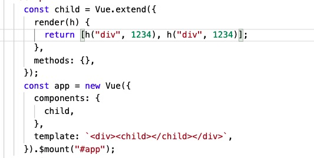
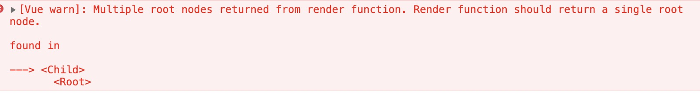

# 实例的渲染

实例的初始化渲染之后，就会调用`beforeCreate`的方法

## 1、renderMixin

```js
function renderMixin(Vue) {
  // install runtime convenience helpers
  installRenderHelpers(Vue.prototype);

  Vue.prototype.$nextTick = function(fn) {};

  Vue.prototype._render = function() {};
}
```

### 1.1、Vue.prototype.\$nextTick

```js
Vue.prototype.$nextTick = function(fn) {
  return nextTick(fn, this);
};
```

`Vue.prototype.$nextTick`调用了 `nextTick`，`nextTick` 涉及`watcher`的调度和`event loop`，之后在`nextTick`的章节讨论。

### 1.2、Vue.prototype.\_render

将这个函数分为三部分来讨论，第一部分：

```js
Vue.prototype._render = function() {
  var vm = this;
  var ref = vm.$options;
  // 这个render肯定是存在的，在 mountComponent 里，如果不存在render，就会创建一个空节点
  var render = ref.render;
  var _parentVnode = ref._parentVnode;

  if (_parentVnode) {
    vm.$scopedSlots = normalizeScopedSlots(
      _parentVnode.data.scopedSlots,
      vm.$slots,
      vm.$scopedSlots
    );
  }

  // set parent vnode. this allows render functions to have access
  // to the data on the placeholder node.
  vm.$vnode = _parentVnode;
  // ...
};
```

`_render`函数通过当前实例的选项`$options`获取`render`，`render`返回当前实例的`vnode`树。然后获取`_parentVnode`，`_parentVnode`是父组件中的预置`vnode`节点，如果这个节点存在，归一化当前的插槽，并且赋值到当前实例的`$scopedSlots`上，`normalizeScopedSlots`细节会在插槽详细介绍。

实例的`$vnode`表示当前实例根`vnode`节点，这里设置了父级的预置节点，这样就可以访问父类预置节点上面的数据。第二部分：

```js
// ...
// render self
var vnode;
try {
  // There's no need to maintain a stack because all render fns are called
  // separately from one another. Nested component's render fns are called
  // when parent component is patched.
  currentRenderingInstance = vm;
  vnode = render.call(vm._renderProxy, vm.$createElement);
} catch (e) {
  handleError(e, vm, "render");
  // return error render result,
  // or previous vnode to prevent render error causing blank component
  /* istanbul ignore else */
  if (vm.$options.renderError) {
    try {
      vnode = vm.$options.renderError.call(
        vm._renderProxy,
        vm.$createElement,
        e
      );
    } catch (e) {
      handleError(e, vm, "renderError");
      vnode = vm._vnode;
    }
  } else {
    vnode = vm._vnode;
  }
} finally {
  currentRenderingInstance = null;
}
// ...
```

这部分是生成`vnode`的代码，指定当前实例为`currentRenderingInstance`；这里作者也备注了*并没有必要使用一个栈，因为渲染函数一个一个地独立被调用，嵌套组件的渲染函数都是父组件的打完补丁才轮到子组件*。所以只要一个 flag 来标识当然的渲染中实例就可以。这个字段可以追溯到`resolveAsyncComponent`函数中，主要跟异步组件的创建有关系。之后在异步组件会讨论。

`vnode = render.call(vm._renderProxy, vm.$createElement)`在`实例的属性代理`讲过，属性的代理可以有更好警告提示。不论通过手写`render`或者编译的`template`，都存在很大的几率报错，所以使用了`try...catch...`来捕获`render`的执行。如果走入了 catch 代码块，开发者定义过`renderError`，那么执行 `renderError` 的错误处理；

`vm._vnode`的赋值操作来自于`initRender`中`vm._vnode = null`，如果执行 render 报错，那么`vnode`会被赋值为`null`。第三部分：

```js
// if the returned array contains only a single node, allow it
if (Array.isArray(vnode) && vnode.length === 1) {
  vnode = vnode[0];
}
// return empty vnode in case the render function errored out
if (!(vnode instanceof VNode)) {
  if (Array.isArray(vnode)) {
    warn(
      "Multiple root nodes returned from render function. Render function " +
        "should return a single root node.",
      vm
    );
  }
  vnode = createEmptyVNode();
}
// set parent
vnode.parent = _parentVnode;
return vnode;
```

如果返回的是一个数组并且里面只有一个元素，那么`vnode`就是数组中的第一个元素，这个特性是为了在不破坏现有代码的结构来使`render`函数 return`this.$scopedSlots.default({})`仍然可以工作，针对于 vue 之前版本的一个兼容（https://github.com/vuejs/vue/issues/8056）。

如果返回的是一个数组，但存在多个元素。会报错：

`console`信息：


当是函数组件时（`Functional components`），可能会返回包含多个子节点的数组。函数组件（`Functional components`）返回一个数组而不是单个根节点的例子：

```js
const child = Vue.extend({
  functional: true,
  render(h) {
    return [1, 2];
  },
});
const app = new Vue({
  components: {
    child,
  },
  template: `<child></child>`,
}).\$mount("#app");
```

注：函数组件不存在`vm`，并不会走入`_render`。而是使用`createFunctionalComponent`生成函数组件，内部不会校验多根问题。

最后`vnode.parent`指向`_parentVnode`也就是当前父组件的节点，并返回`vnode`。

## 2、initRender

```js
function initRender(vm) {
  // 子虚拟dom的根节点
  vm._vnode = null; // the root of the child tree
  vm._staticTrees = null; // v-once cached trees
  var options = vm.$options;
  // 预置的节点
  var parentVnode = (vm.$vnode = options._parentVnode); // the placeholder node in parent tree
  // 渲染上下文
  var renderContext = parentVnode && parentVnode.context;
  // 插槽
  vm.$slots = resolveSlots(options._renderChildren, renderContext);
  // 作用域插槽
  vm.$scopedSlots = emptyObject;
  // bind the createElement fn to this instance
  // so that we get proper render context inside it.
  // args order: tag, data, children, normalizationType, alwaysNormalize
  // internal version is used by render functions compiled from templates
  vm._c = function(a, b, c, d) {
    return createElement(vm, a, b, c, d, false);
  };
  // normalization is always applied for the public version, used in
  // user-written render functions.
  vm.$createElement = function(a, b, c, d) {
    return createElement(vm, a, b, c, d, true);
  };

  // $attrs & $listeners are exposed for easier HOC creation. HOC 高阶组件
  // they need to be reactive so that HOCs using them are always updated
  var parentData = parentVnode && parentVnode.data;

  /* istanbul ignore else */
  {
    defineReactive$$1(
      vm,
      "$attrs",
      (parentData && parentData.attrs) || emptyObject,
      function() {
        !isUpdatingChildComponent && warn("$attrs is readonly.", vm);
      },
      true
    );
    defineReactive$$1(
      vm,
      "$listeners",
      options._parentListeners || emptyObject,
      function() {
        !isUpdatingChildComponent && warn("$listeners is readonly.", vm);
      },
      true
    );
  }
}
```

参数的解释:

- `_vnode` 子类根节点
- `_staticTrees` 是否是`v-once`修饰过的节点，展现为只会渲染一次
- `$vnode`使用`$options`上的引用`_parentVnode`
- `$vnode.context`渲染上下文
- `$slots`插槽对象
- `$scopedSlots`作用域插槽对象
- `_c`是`createElement`内部的版本，最终还是调用`createElement`函数。
- `$createElement`，针对于手写的 render 函数，最终还是调用`createElement`函数。
- `$attrs`除了`class`和`style`之外的属性集合
- `$listeners`所有的自定义事件集合
- `$options._parentVnode`是一个`Vnode`类型，这里和`$vnode`一致，都是父类中的预置虚拟节点；它的赋值在以下函数：
  - 在`initInternalComponent`方法中`opts._parentVnode = parentVnode`；
  - 在`updateChildComponent`方法中`vm.$options._parentVnode = parentVnode`；
- `$options._renderChildren`是一个 `Vnode[]`类型，插槽的虚拟节点，里面存放是需要插槽渲染的节点；它的赋值在以下函数：
  - 在`initInternalComponent`方法中`opts._renderChildren = vnodeComponentOptions.children;`；
  - 在`updateChildComponent`方法中`vm.$options._renderChildren = renderChildren;`；

这个方法主要是初始化了插槽和作用域插槽，定义了`_c`和`$createElement`方法。构建了`$attr`和`$listeners`的响应式。

### 2.1、构建插槽方法

```js
/**
 * Runtime helper for resolving raw children VNodes into a slot object.
 * 运行时将子类vnode维护到插槽对象之中
 */
function resolveSlots(children, context) {
  // 如果不存在子类的集合 那么直接返回一个空对象
  if (!children || !children.length) {
    return {};
  }
  var slots = {};
  for (var i = 0, l = children.length; i < l; i++) {
    var child = children[i];
    var data = child.data;
    // remove slot attribute if the node is resolved as a Vue slot node
    // 删除 数据对象的 attrs属性上的 slot的属性
    // 这里处理的是老的语法 https://cn.vuejs.org/v2/guide/components-slots.html#%E5%BA%9F%E5%BC%83%E4%BA%86%E7%9A%84%E8%AF%AD%E6%B3%95
    // 新语法 v-slot:具名="";$slots 和 $slotScopes都会存在
    if (data && data.attrs && data.attrs.slot) {
      delete data.attrs.slot;
    }
    // named slots should only be respected if the vnode was rendered in the
    // same context.
    // 具名插槽只有当前虚拟节点所在的相同上下文中才可以提供
    // _renderChildren 中的虚拟dom上下文和传入上下文一致，并且fnContext和传入上下文一致
    if (
      (child.context === context || child.fnContext === context) &&
      data &&
      data.slot != null
    ) {
      // 访问数据对象中的 slot字段，获取具名插槽的名称
      var name = data.slot;
      var slot = slots[name] || (slots[name] = []);
      if (child.tag === "template") {
        slot.push.apply(slot, child.children || []);
      } else {
        slot.push(child);
      }
    } else {
      (slots.default || (slots.default = [])).push(child);
    }
  }
  // ignore slots that contains only whitespace
  // 忽略包含空格的slots
  for (var name$1 in slots) {
    if (slots[name$1].every(isWhitespace)) {
      delete slots[name$1];
    }
  }
  return slots;
}
```

简单过一下这个函数，之后探讨插槽重点深入

### 2.2、`vm._staticTrees`

```js
function renderStatic(index, isInFor) {
  var cached = this._staticTrees || (this._staticTrees = []);
  var tree = cached[index];
  // if has already-rendered static tree and not inside v-for,
  // we can reuse the same tree.
  if (tree && !isInFor) {
    return tree;
  }
  // otherwise, render a fresh tree.
  tree = cached[index] = this.$options.staticRenderFns[index].call(
    this._renderProxy,
    null,
    this // for render fns generated for functional component templates
  );
  markStatic(tree, "__static__" + index, false);
  return tree;
}
```

`vm._staticTrees`在`renderStatic`函数中维护。`vm._staticTrees`的数据结构为`Vnode[]`，用来存放静态的节点也就是使用`v-once`属性修饰的节点；排列顺序如下：

- 同时存在父子静态节点，子节点会放在父节点的前面
- 同时存在兄弟静态节点，顺序为模板书写的顺序

```
 input : `<div><span v-once><slot name="a"></slot><slot name="b"></slot></span><a v-once></a></div>`
 output: [VNode {tag: "span",…}, VNode {tag: "a",…} ]
 // span 包含 a
 input : `<div><span v-once><slot name="a"></slot><a v-once><slot name="b"></slot></a></span></div>`
 output: [VNode {tag: "a",…}, VNode {tag: "span",…} ]
```

构建静态节点所使用的对象为`$options.staticRenderFns`，我们可以在`webpack`build 之后的文件中找个这样的一个例子，存在两个`v-once`修饰的元素，最后生成两个静态 render 函数

```js
var staticRenderFns = [
  function() {
    var _vm = this;
    var _h = _vm.$createElement;
    var _c = _vm._self._c || _h;
    return _c("ul", [
      _c("li", [
        _c("img", {
          attrs: {
            src:
              "https://static.soyoung.com/sy-pre/2020061101-1591855800720.png",
          },
        }),
        _c("p", [_vm._v("内容浏览量收益")]),
        _c("span", [_vm._v("高浏览带来高收入！")]),
      ]),
      _c("li", [
        _c("img", {
          attrs: {
            src:
              "https://static.soyoung.com/sy-pre/2020061102-1591855800720.png",
          },
        }),
        _c("p", [_vm._v("更多流量奖励")]),
        _c("span", [_vm._v("内容互动赢取更多流量")]),
      ]),
      _c("li", [
        _c("img", {
          attrs: {
            src:
              "https://static.soyoung.com/sy-pre/2020061103-1591855800720.png",
          },
        }),
        _c("p", [_vm._v("新氧新星指日可待")]),
        _c("span", [_vm._v("创作指引，榜单活动")]),
      ]),
    ]);
  },
  function() {
    var _vm = this;
    var _h = _vm.$createElement;
    var _c = _vm._self._c || _h;
    return _c("div", { staticClass: "foot" }, [
      _c("p", [
        _vm._v("\n        加入条件\n        "),
        _c("span", [_vm._v("以下条件满足其中一项即可申请加入")]),
      ]),
      _c("p", [_vm._v("1、达人：90天通过首页审核内容数>=5")]),
      _c("p", [_vm._v("2、普通用户：粉丝数>=50，90天内通过首页审核内容数>=3")]),
    ]);
  },
];
```

### 2.3、\_c vs \$createElement

1. `_c`内部使用，不需要每次都归一化，只需要扁平化 children 数组就可以；
2. `$createElement`作为 h 传入到`$options.render`中，那么手写的 render 有可能存在很多不规范的地方，因此需要校验和归一化。

### 2.4、$attrs 和 $listeners 的响应式

`$attr`字段是当前`vm`除了`class`和`style`之外的标签属性对象。在`updateChildComponent`函数中维护
`vm.$attrs = parentVnode.data.attrs || emptyObject;`；当`inheritAttrs`为 false 时，我们可以通过`v-bind:$attrs`将父类预置节点上的属性“转嫁”到子类的根节点上，给与响应式的意义在于，如果父类预置节点上的属性有变化，那么子类也会触发响应式。`$listeners`同理。

## 3、总结

`renderMixin`维护了`_render`和`$nextTick`的两个方法，实例的内部方法`_render`是非函数组件调用生成`vnode`的函数，触发时机在调用`vm._update`时，第一参数传入的`vnode`，就是依赖`_render`生成的：`vm._update(vm._render(), hydrating)`，可以说这个函数是构建虚拟 dom 最顶层的方法。

当`vm`调用`initRender`后，和渲染相关的参数基本初始化完毕：`_vnode`的定义，是否静态树，预置节点，渲染上下文，插槽相关以及`$attrs`和`$listeners`的响应式处理。
