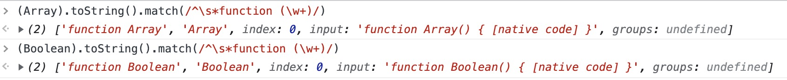

# 实例的状态

## 1、stateMixin

```js
function stateMixin(Vue) {
  // flow somehow has problems with directly declared definition object
  // when using Object.defineProperty, so we have to procedurally build up
  // the object here.
  var dataDef = {};
  dataDef.get = function() {
    return this._data;
  };
  var propsDef = {};
  propsDef.get = function() {
    return this._props;
  };
  // 如果在dev环境
  {
    dataDef.set = function() {
      warn(
        "Avoid replacing instance root $data. " +
          "Use nested data properties instead.",
        this
      );
    };
    propsDef.set = function() {
      warn("$props is readonly.", this);
    };
  }
  Object.defineProperty(Vue.prototype, "$data", dataDef);
  Object.defineProperty(Vue.prototype, "$props", propsDef);

  Vue.prototype.$set = set;
  Vue.prototype.$delete = del;

  Vue.prototype.$watch = function(expOrFn, cb, options) {
    var vm = this;
    if (isPlainObject(cb)) {
      return createWatcher(vm, expOrFn, cb, options);
    }
    options = options || {};
    options.user = true;
    var watcher = new Watcher(vm, expOrFn, cb, options);
    if (options.immediate) {
      try {
        cb.call(vm, watcher.value);
      } catch (error) {
        handleError(
          error,
          vm,
          'callback for immediate watcher "' + watcher.expression + '"'
        );
      }
    }
    return function unwatchFn() {
      watcher.teardown();
    };
  };
}
```

- 设置`$data`和`$props`属性，在 dev 模式下替换这两个值会提示报错。
- 定义`Vue.prototype.$set`、`Vue.prototype.$delete`、`Vue.prototype.$watch`

## 2、initState

```js
function initState(vm) {
  vm._watchers = [];
  var opts = vm.$options;
  if (opts.props) {
    initProps(vm, opts.props);
  }
  if (opts.methods) {
    initMethods(vm, opts.methods);
  }
  if (opts.data) {
    initData(vm);
  } else {
    observe((vm._data = {}), true /* asRootData */);
  }
  if (opts.computed) {
    initComputed(vm, opts.computed);
  }
  if (opts.watch && opts.watch !== nativeWatch) {
    initWatch(vm, opts.watch);
  }
}
```

1. 初始化观察数组`_watchers`
2. 初始化 `props`
3. 初始化 `methods`
4. 初始化 `data`
5. 初始化 `computed`
6. 初始化 `watch`

## 3、initProps

```js
function initProps(vm, propsOptions) {
  var propsData = vm.$options.propsData || {};
  var props = (vm._props = {});
  var keys = (vm.$options._propKeys = []);
  var isRoot = !vm.$parent;
  if (!isRoot) {
    toggleObserving(false);
  }
  var loop = function(key) {
    keys.push(key);
    var value = validateProp(key, propsOptions, propsData, vm);
    {
      var hyphenatedKey = hyphenate(key);
      if (
        isReservedAttribute(hyphenatedKey) ||
        config.isReservedAttr(hyphenatedKey)
      ) {
        warn(
          '"' +
            hyphenatedKey +
            '" is a reserved attribute and cannot be used as component prop.',
          vm
        );
      }
      defineReactive$$1(props, key, value, function() {
        if (!isRoot && !isUpdatingChildComponent) {
          warn(
            "Avoid mutating a prop directly since the value will be " +
              "overwritten whenever the parent component re-renders. " +
              "Instead, use a data or computed property based on the prop's " +
              'value. Prop being mutated: "' +
              key +
              '"',
            vm
          );
        }
      });
    }
    if (!(key in vm)) {
      proxy(vm, "_props", key);
    }
  };
  for (var key in propsOptions) loop(key);
  toggleObserving(true);
}
```

`vm.$options.propsData`，官方文档**创建实例时传递 props。主要作用是方便测试。**只用于`new`创建的实例中。但通过例子可以看出这个值是父类通过属性向子类传递的值。

定义实例内部属性`vm._props`，定义属性缓存数组`vm.$options._propKeys`，使用数组迭代代替对象属性的枚举来更新属性。根节点的属性需要被转换，也就是根部节点的`props`会被转换为响应式。

`propsOptions`是当前子类选项中的`props`，传入的值为`vm.$options.props`，`props`在 `vm.$options`的原型链上。如下：

```js
function initInternalComponent(vm, options) {
  var opts = (vm.$options = Object.create(vm.constructor.options));
  // ...
}
```

枚举`propsOptions`，`loop`每一个`key`：向`vm.$options._propKeys`添加`key`。调用`validateProp`验证`key`的有效性，调用`defineReactive$$1`给每个`key`添加响应式。最终将`key`代理到`vm._props`。

### 3.1、`validateProp`函数

首先我们看下官方的属性验证 https://cn.vuejs.org/v2/guide/components-props.html#Prop-%E9%AA%8C%E8%AF%81
props 的多种形态

```js
Vue.component("my-component", {
  props: {
    // 基础的类型检查 (`null` 和 `undefined` 会通过任何类型验证)
    propA: Number,
    // 多个可能的类型
    propB: [String, Number],
    // 必填的字符串
    propC: {
      type: String,
      required: true,
    },
    // 带有默认值的数字
    propD: {
      type: Number,
      default: 100,
    },
    // 带有默认值的对象
    propE: {
      type: Object,
      // 对象或数组默认值必须从一个工厂函数获取
      default: function() {
        return { message: "hello" };
      },
    },
    // 自定义验证函数
    propF: {
      validator: function(value) {
        // 这个值必须匹配下列字符串中的一个
        return ["success", "warning", "danger"].indexOf(value) !== -1;
      },
    },
  },
});
```

将这个函数分三个部分来看，第一部分：

```js
function validateProp(key, propOptions, propsData, vm) {
  var prop = propOptions[key];
  var absent = !hasOwn(propsData, key);
  var value = propsData[key];
  // boolean casting
  var booleanIndex = getTypeIndex(Boolean, prop.type);
  // ...
}
```

`validateProp`的参数说明：

- `key`: `props` 的 `key`
- `propOptions`:`vm.$options.props`（选项里面的`props`）
- `propsData`:`vm.$options.propsData`
- `vm`:当前的 vue 实例

针对于`props`的`type`，是可以指定多个类型可选，`[Boolean,String]`既可以指定布尔类型，也可以使用字符串类型。当传入的可选类型包含了布尔和字符串类型，这里有一个优先级策略的逻辑：

`getTypeIndex`函数获取当前类型在`props.type`可选类型中的数组下标`index`，如果`props.type`是一个值，那么数组下标为`0`，如果是传入了多个值`props.type`是一个数组，那么查找数组中这个类型的位置`index`:

```js
function getTypeIndex(type, expectedTypes) {
  if (!Array.isArray(expectedTypes)) {
    return isSameType(expectedTypes, type) ? 0 : -1;
  }
  for (var i = 0, len = expectedTypes.length; i < len; i++) {
    if (isSameType(expectedTypes[i], type)) {
      return i;
    }
  }
  return -1;
}
```

- `type`：要查找的类型，比如包装对象`Boolean`或者引用对象`Array`
- `expectedTypes` `vm.$options.props[key].type`，期望的可选类型

`isSameType`和 `getType`的实现

```js
function isSameType(a, b) {
  return getType(a) === getType(b);
}
function getType(fn) {
  var match = fn && fn.toString().match(/^\s*function (\w+)/);
  return match ? match[1] : "";
}
```

`getType`的打印


通过上面的例子可以看出，`getType`的功能是通过构造函数名，获取当前的类型。`isSameType`判断是否是两个相同的类型。
例如传入`Boolean`和`Boolean`，返回 `0`

`validateProp`的第二部分:

```js
// ...
var booleanIndex = getTypeIndex(Boolean, prop.type);
if (booleanIndex > -1) {
  if (absent && !hasOwn(prop, "default")) {
    value = false;
  } else if (value === "" || value === hyphenate(key)) {
    // only cast empty string / same name to boolean if
    // boolean has higher priority
    var stringIndex = getTypeIndex(String, prop.type);
    if (stringIndex < 0 || booleanIndex < stringIndex) {
      value = true;
    }
  }
}
// ...
```

这里针对于 Boolean 的这种类型，有一个优先策略：
如果 prop.type（`vm.$options.props[key].type`）配置了`Boolean`类型才会走入下面两种情况（**先决条件**）

1. 父组件中未提供这个值（`!hasOwn(propsData, key)`）并且没有给这个属性提供默认值（`!hasOwn(prop, "default")`），那么 `value` 为 false。这情况针对于父组件**没有**传入值并且**没有默认值**的情况。符合常规好理解。

2. 如果父组件提供的`propsData[key]`是一个空字符串`""`或者`propsData[key]` 和 `key`一致：（**先决条件 2**）
   - prop.type（`vm.$options.props[key].type`）没有配置 String 这种类型，`value` 为 true
   - 布尔值的优先级大于字符串的优先级，`value` 为 true

情况 2 是针对于 dom 的 property 的场景：

```js
props: {
  a: {
    type: [Boolean, String];
  }
}
// <button disabled=""></button>
// 子组件中 this.a 为 true
// 或者
props: {
  a: {
    type: [Boolean, String];
  }
}
//<button disabled="disabled"></button>
// 子组件中 this.disabled 为 true
```

在浏览器中，`<button>`都会识别设置为 `disabled`。

3. 如果在**先决条件 2**中，如果 String 的优先级比较大，那么 value 等于父组件传入的值（该情况下空字符或者 key 的值）

```js
props: {
  a: {
    type: [String, Boolean];
  }
}
//<button disabled="disabled"></button>
// 子组件中 this.disabled 为 disabled
```

综上，我们处理完了 prop.type（`vm.$options.props[key].type`） 存在 `Boolean` 的情况，接下来看`validateProp`的第三部分:

```js
// check default value
if (value === undefined) {
  value = getPropDefaultValue(vm, prop, key);
  // since the default value is a fresh copy,
  // make sure to observe it.
  var prevShouldObserve = shouldObserve;
  toggleObserving(true);
  observe(value);
  toggleObserving(prevShouldObserve);
}
{
  assertProp(prop, key, value, vm, absent);
}
return value;
```

不符合**先决条件 1**（不存于 `Boolean` 类型的可能性），如果 `value` 是个`undefined`，也就是在父组件的 propsData 中并没有提供这个值,首先使用`getPropDefaultValue(vm, prop, key);`，获取当前的值：

```js
function getPropDefaultValue(vm, prop, key) {
  // no default, return undefined
  if (!hasOwn(prop, "default")) {
    return undefined;
  }
  var def = prop.default;
  // warn against non-factory defaults for Object & Array
  if (isObject(def)) {
    warn(
      'Invalid default value for prop "' +
        key +
        '": ' +
        "Props with type Object/Array must use a factory function " +
        "to return the default value.",
      vm
    );
  }
  // the raw prop value was also undefined from previous render,
  // return previous default value to avoid unnecessary watcher trigger
  if (
    vm &&
    vm.$options.propsData &&
    vm.$options.propsData[key] === undefined &&
    vm._props[key] !== undefined
  ) {
    return vm._props[key];
  }
  // call factory function for non-Function types
  // a value is Function if its prototype is function even across different execution context
  return typeof def === "function" && getType(prop.type) !== "Function"
    ? def.call(vm)
    : def;
}
```

该函数有三种情况，并且返回不同的结果，指定了 prop.default(`vm.$options.props[key].default`)的值，为**先决条件 1**，prop.default 的值如果是引用类型，必须使用工厂函数返回一个新的引用对象，否则发出警告。

1. 不满足**先决条件 1**，直接返回一个`undefined`；
2. 满足**先决条件 1**，`vm.$options.propsData[key] === undefined`&&`vm._props[key] !== undefined`，那么返回`vm._props[key]`；否则执行 3；
3. 满足**先决条件 1**，如果是函数，执行其工厂函数返回对应值。否则返回这个默认值。

使用`getPropDefaultValue`，返回一个新的值，使用`observe(value);`将其变为响应式。

接下来执行`assertProp`函数

```js
function assertProp(prop, name, value, vm, absent) {
  if (prop.required && absent) {
    warn('Missing required prop: "' + name + '"', vm);
    return;
  }
  if (value == null && !prop.required) {
    return;
  }
  var type = prop.type;
  var valid = !type || type === true;
  var expectedTypes = [];
  if (type) {
    if (!Array.isArray(type)) {
      type = [type];
    }
    for (var i = 0; i < type.length && !valid; i++) {
      var assertedType = assertType(value, type[i]);
      expectedTypes.push(assertedType.expectedType || "");
      valid = assertedType.valid;
    }
  }

  if (!valid) {
    warn(getInvalidTypeMessage(name, value, expectedTypes), vm);
    return;
  }
  var validator = prop.validator;
  if (validator) {
    if (!validator(value)) {
      warn(
        'Invalid prop: custom validator check failed for prop "' + name + '".',
        vm
      );
    }
  }
}
}
```

1. 校验 prop.required（`vm.$options.props[key].required`）,如果`propsData[key]`没有给定值，那么警告提示。
2. 获取 type，校验 type 和 value 的类型是否一致。对于未通过的校验，给与警告。
3. 针对于提供了`prop.validator`方法的，如果`prop.validator`返回了 false，那么发出警告。

至此整个`validateProp`函数结束

### 3.2、总结：

`initProps`根据传入的`propsOptions`和`vm.$options.propsData`（父组件的传值），对`vm._props`进行了校验、响应式处理。并最终代理到自身`vm`上。

`propsOptions`是初始化时选项的`props`属性，也可以通过`vm.$options.props`访问，`vm.$options`继承了`vm.constructor.options`；`vm.$options.propsData`是父组件传递给子组件的值

`validateProp`函数是`initProps`的核心，简单来看，`validateProp`主要做了四个事情：

1. 获取`var value = propsData[key];`；
2. 处理 prop.type 是布尔值的情况，干预 value 的取值；
3. 如果 `value` 父组件没有提供，那么计算默认值，并且为其添加响应式；
4. 以上都是取值操作，最后通过`assertProp`校验并发出警告。返回这个`value`。

最终为这个`value`添加响应式处理

## 4、initMethods

```js
function initMethods(vm, methods) {
  var props = vm.$options.props;
  for (var key in methods) {
    {
      if (typeof methods[key] !== "function") {
        warn(
          'Method "' +
            key +
            '" has type "' +
            typeof methods[key] +
            '" in the component definition. ' +
            "Did you reference the function correctly?",
          vm
        );
      }
      if (props && hasOwn(props, key)) {
        warn('Method "' + key + '" has already been defined as a prop.', vm);
      }
      if (key in vm && isReserved(key)) {
        warn(
          'Method "' +
            key +
            '" conflicts with an existing Vue instance method. ' +
            "Avoid defining component methods that start with _ or $."
        );
      }
    }
    vm[key] =
      typeof methods[key] !== "function" ? noop : bind(methods[key], vm);
  }
}
```

初始化实例的方法比较简单：

1. 如果当前方法不是一个函数，发出警告；
2. 如果方法名和 `prop` 名冲突，发出警告；
3. 如果当前方法名已经在`vm`中，并且以\_或者\$开头，发出警告：冲突、避免使用\_或\$开始；
4. 方法直接挂载在 `vm` 上，兼容处理非函数为`noop`空函数，合法函数强制绑定执行上下文为 `vm`

## 5、initData

```js
function initData(vm) {
  var data = vm.$options.data;
  data = vm._data = typeof data === "function" ? getData(data, vm) : data || {};
  if (!isPlainObject(data)) {
    data = {};
    warn(
      "data functions should return an object:\n" +
        "https://vuejs.org/v2/guide/components.html#data-Must-Be-a-Function",
      vm
    );
  }
  // proxy data on instance
  var keys = Object.keys(data);
  var props = vm.$options.props;
  var methods = vm.$options.methods;
  var i = keys.length;
  while (i--) {
    var key = keys[i];
    {
      if (methods && hasOwn(methods, key)) {
        warn(
          'Method "' + key + '" has already been defined as a data property.',
          vm
        );
      }
    }
    if (props && hasOwn(props, key)) {
      warn(
        'The data property "' +
          key +
          '" is already declared as a prop. ' +
          "Use prop default value instead.",
        vm
      );
    } else if (!isReserved(key)) {
      proxy(vm, "_data", key);
    }
  }
  // observe data
  observe(data, true /* asRootData */);
}
```

`vm.$options.data`如果是个函数，调用`getData`函数获取当前的`vm._data`：

```js
function getData(data, vm) {
  // #7573 disable dep collection when invoking data getters
  pushTarget();
  try {
    return data.call(vm, vm);
  } catch (e) {
    handleError(e, vm, "data()");
    return {};
  } finally {
    popTarget();
  }
}
```

`pushTarget`、`popTarget`是 `Dep` 文件中维护的方式，在深入响应式的会讲解；调用 `data` 函数，返回函数的执行结果。获取`data`的 key 集合，迭代判断是否与`props`、`methods`有冲突，如果存在会警告提示；如果不存在冲突，并且不以`_`或者`$`开头，代理当前 key 到`vm._data`，最后添加响应式处理。

## 6、initComputed

```js
var computedWatcherOptions = { lazy: true };

function initComputed(vm, computed) {
  var watchers = (vm._computedWatchers = Object.create(null));
  var isSSR = isServerRendering();

  for (var key in computed) {
    var userDef = computed[key];
    var getter = typeof userDef === "function" ? userDef : userDef.get;
    if (getter == null) {
      warn('Getter is missing for computed property "' + key + '".', vm);
    }

    if (!isSSR) {
      // create internal watcher for the computed property.
      watchers[key] = new Watcher(
        vm,
        getter || noop,
        noop,
        computedWatcherOptions
      );
    }

    // component-defined computed properties are already defined on the
    // component prototype. We only need to define computed properties defined
    // at instantiation here.
    if (!(key in vm)) {
      defineComputed(vm, key, userDef);
    } else {
      if (key in vm.$data) {
        warn(
          'The computed property "' + key + '" is already defined in data.',
          vm
        );
      } else if (vm.$options.props && key in vm.$options.props) {
        warn(
          'The computed property "' + key + '" is already defined as a prop.',
          vm
        );
      }
    }
  }
}
```

初始化计算属性的大体流程：

1. 生成一个空对象`vm._computedWatchers`；
2. 枚举`vm.$options.computed`，如果`computed[key]`是一个函数，这个函数就是当前计算属性的`getter`函数，否则，获取`computed[key].get`当做`getter`函数；
3. 如果获得的这个`getter`函数是`null`，会抛出一个警告；
4. 在浏览器端，使用`Watcher`构建计算属性；
5. 如果当前属性不存在于`vm`，使用`defineComputed`函数挂载计算属性到`vm`；
6. 否则校验`data`或`props`有冲突。

综上，首先兼容的获取 get 函数，使用`Watcher`构建计算属性，最终挂载到`vm`上。

`defineComputed`函数

```js
function defineComputed(target, key, userDef) {
  var shouldCache = !isServerRendering();
  if (typeof userDef === "function") {
    sharedPropertyDefinition.get = shouldCache
      ? createComputedGetter(key)
      : createGetterInvoker(userDef);
    sharedPropertyDefinition.set = noop;
  } else {
    sharedPropertyDefinition.get = userDef.get
      ? shouldCache && userDef.cache !== false
        ? createComputedGetter(key)
        : createGetterInvoker(userDef.get)
      : noop;
    sharedPropertyDefinition.set = userDef.set || noop;
  }
  if (sharedPropertyDefinition.set === noop) {
    sharedPropertyDefinition.set = function() {
      warn(
        'Computed property "' + key + '" was assigned to but it has no setter.',
        this
      );
    };
  }
  Object.defineProperty(target, key, sharedPropertyDefinition);
}
```

计算属性的思路是获取其`key`对应的对象或者`get`函数，重新使用`Object.defineProperty`定义这个属性的读写操作功能。

如果传入的是一个函数，那么表示开发者只使用了`get`函数，将一个`noop`空函数赋值给它的`set`函数。如果传入是一个对象，也就意味着同时定义了`get`和`set`函数。最终使用`Object.defineProperty`挂载到当前的`vm`上。
细节有两处：

1. 在浏览器端开启缓存，在 ssr 不开启缓存。
2. 浏览器端`createComputedGetter` 和 ssr 的`createGetterInvoker`

`createComputedGetter`函数

```js
function createComputedGetter(key) {
  return function computedGetter() {
    var watcher = this._computedWatchers && this._computedWatchers[key];
    if (watcher) {
      if (watcher.dirty) {
        watcher.evaluate();
      }
      if (Dep.target) {
        watcher.depend();
      }
      return watcher.value;
    }
  };
}
```

一个高阶函数，返回`computedGetter`，这个函数访问了当前的`watcher`(`this._computedWatchers && this._computedWatchers[key]`)，如果当前的`watcher`的依赖有变更，那么会触发`watcher.evaluate()`重新计算当前`watcher.value`，重新搜集依赖，返回当前计算结果；如果没有依赖变更，直接返回之前的计算结果；具体细节在响应式介绍。

`createGetterInvoker`函数

```js
function createGetterInvoker(fn) {
  return function computedGetter() {
    return fn.call(this, this);
  };
}
```

直接重新调用返回结果。

## 7、initWatch

```js
var nativeWatch = {}.watch;
function initWatch(vm, watch) {
  for (var key in watch) {
    var handler = watch[key];
    if (Array.isArray(handler)) {
      for (var i = 0; i < handler.length; i++) {
        createWatcher(vm, key, handler[i]);
      }
    } else {
      createWatcher(vm, key, handler);
    }
  }
}

function createWatcher(vm, expOrFn, handler, options) {
  if (isPlainObject(handler)) {
    options = handler;
    handler = handler.handler;
  }
  if (typeof handler === "string") {
    handler = vm[handler];
  }
  return vm.$watch(expOrFn, handler, options);
}
```

`nativeWatch`:火狐浏览器拥有 `Object.prototype.watch` 方法，排除掉这种情况。枚举`vm.$options.watch`，使用`createWatcher`来构建一个自定义`Watcher`；`createWatcher`函数内部还是调用了`vm.$watcher`。详细原理在响应式讨论。

到这里为止，`initState`函数就讨论完了。在执行完`initProvide`之后（在 inject、provide 已经讨论完了），就会调用`callHook(vm, "created");`，实例的状态也基本初始化完成。接下来准备挂载 dom 实例。

```js
// 如果提供el那么挂载
if (vm.$options.el) {
  vm.$mount(vm.$options.el);
}
```

总结：
`initState`函数，初始化了实例的`props`、`method`、`data`、`computed`、`watch`。通过初始化的顺序，我们了解到在`data`函数里面可以使用`props`来初始化实例局部的变量，也可以在`data`函数中访问`method`，当然如果`method`如果需要`data`的值，那么这个值是`undefiend`，掌握了这个顺序我们就可以放心大胆的做一些事情。

几个初始化的工作，在`initProps`是最复杂的，不仅需要校验它的类型，可能还要获取默认值，要兼容一些`Boolean`的场景，抛出一些友好的警告；计算属性是`lazy watcher`，被标记为`dirty = true`的`watcher`，才会重新计算一次结果。

`props`、`data`、`computed`都需要处理成响应式，而响应式的实现底层还是使用了`Watcher`，这个我们会在之后的响应式中讨论。
