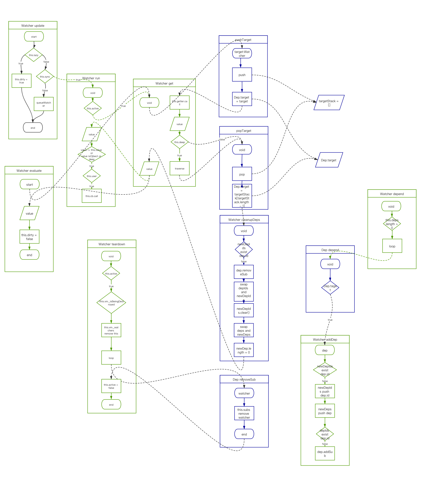

# vue observer

> 数据响应式核心

Dep、Watcher、Observer 调用图 ⏬


包括以下内容：

- Dep
- Watcher
- Observer
- scheduler

## 1、Dep

```js
var uid = 0;
var Dep = function Dep() {
  this.id = uid++;
  this.subs = [];
};

Dep.prototype.addSub = function addSub(sub) {
  this.subs.push(sub);
};

Dep.prototype.removeSub = function removeSub(sub) {
  remove(this.subs, sub);
};

Dep.prototype.depend = function depend() {
  if (Dep.target) {
    Dep.target.addDep(this);
  }
};

Dep.prototype.notify = function notify() {
  // stabilize the subscriber list first
  var subs = this.subs.slice();
  if (!config.async) {
    subs.sort(function(a, b) {
      return a.id - b.id;
    });
  }
  for (var i = 0, l = subs.length; i < l; i++) {
    subs[i].update();
  }
};
```

- `uid`：当前`dep`的 uid，自增，主要标识一个`Dep`实例的唯一性，在`Watcher`内部方便查找。
- `subs`：当前依赖的`watcher`的集合；
- `Dep.prototype.addSub`，向`subs`添加一个`watcher`；
- `Dep.prototype.removeSub`，查找`subs`删除这个`watcher`；
- `Dep.prototype.depend`，调用当前`watcher`的`addDep` 方法，添加当前`dep`到`watcher`；添加当前`watcher`到`dep`。
- `Dep.prototype.notify`：
  - `config.async`：异步执行更新。如果为了供 Vue Test Utils 使用设置为 `false`，将导致性能问题；在这里如果设置为`false`，会重新排序当前`subs`里面的所有`watcher`。因为同步模式调度不会重新排序 subs。为了确保它的执行顺序，需要在这里排序。
  - 遍历执行`subs`中的`watcher`的`update`方法。

### 1.1、`pushTarget`和`popTarget`

在一个时间点全局只有一个`watcher`在执行，在调用了`pushTarget`之后，所有实例的`depend`都操作这个`watcher`。

```js
Dep.target = null;
var targetStack = [];

function pushTarget(target) {
  targetStack.push(target);
  Dep.target = target;
}

function popTarget() {
  targetStack.pop();
  Dep.target = targetStack[targetStack.length - 1];
}
```

使用`Dep.target`有几处判断的逻辑：

1. `defineReactive`函数中的`reactiveGetter`函数中，如果存在`Dep.target`，才会进行依赖的收集；
2. 创建计算属性的`createComputedGetter`函数中，如果存在`Dep.target`，才会进行依赖的收集；
3. `dep.depend`的函数，如果存在`Dep.target`，才会进行依赖的收集；

综上可以看出，主要是使用`Dep.target`来断定存在一个有效的`watcher`，避免无效的依赖收集。

## 2、Watcher

```js
var Watcher = function Watcher(vm, expOrFn, cb, options, isRenderWatcher) {};
Watcher.prototype.get = function get() {};
Watcher.prototype.addDep = function addDep(dep) {};
Watcher.prototype.cleanupDeps = function cleanupDeps() {};
Watcher.prototype.update = function update() {};
Watcher.prototype.run = function run() {};
Watcher.prototype.evaluate = function evaluate() {};
Watcher.prototype.depend = function depend() {};
Watcher.prototype.teardown = function teardown() {};
```

### 2.1、构造函数

```js
function Watcher(vm, expOrFn, cb, options, isRenderWatcher) {
  this.vm = vm;
  if (isRenderWatcher) {
    vm._watcher = this;
  }
  vm._watchers.push(this);
  // options
  if (options) {
    this.deep = !!options.deep;
    this.user = !!options.user;
    this.lazy = !!options.lazy;
    this.sync = !!options.sync;
    this.before = options.before;
  } else {
    this.deep = this.user = this.lazy = this.sync = false;
  }
  this.cb = cb;
  this.id = ++uid$2; // uid for batching
  this.active = true;
  this.dirty = this.lazy; // for lazy watchers
  this.deps = [];
  this.newDeps = [];
  this.depIds = new _Set();
  this.newDepIds = new _Set();
  this.expression = expOrFn.toString();
  // parse expression for getter
  if (typeof expOrFn === "function") {
    this.getter = expOrFn;
  } else {
    this.getter = parsePath(expOrFn);
    if (!this.getter) {
      this.getter = noop;
      warn(
        'Failed watching path: "' +
          expOrFn +
          '" ' +
          "Watcher only accepts simple dot-delimited paths. " +
          "For full control, use a function instead.",
        vm
      );
    }
  }
  this.value = this.lazy ? undefined : this.get();
}
```

根据`isRenderWatcher`划分`Watcher`：

- 渲染`Watcher`，创建`Watcher`时传入`isRenderWatcher = true`，`vm._watcher`指向这个渲染`Watcher`；
- 自定义`Watcher`，配置`vm.$options.watch`和`vm.$options.computed`创建的`Watcher`。

它们都会被存放在`vm._watchers`，渲染`Watcher`的创建时机**在`vm.$mount`执行后**，在这之前的`initState`已经调用完毕，`vm.$options.watch`和`vm.$options.computed`内的`Watcher`已经被创建并添加进`vm._watchers`中；所以自定义的`Watcher`先执行`update`，渲染`Watcher`最后执行。

根据`New Watcher`位置，划分`Watcher`：

1. 构建渲染`Watcher`，传入了`options.before`
2. `vm.$watch`的调用，传入了`options.user = true`
3. 计算属性的`Watcher`，传入了`options.lazy = true`，计算属性`vm._computedWatchers`指向它们。

`options`可设置的实例属性：

- deep：为了发现对象内部值的变化，监听数组的变更不需要这么做。一个被标记为`deep`的`Watcher`会在`watcher.get`函数中执行`traverse`。
- user：标识是通过`vm.$watch`方法生成的`Watcher`（`vm.$watch`的调用或者`vm.$options.watch`的配置），因为开发者提供的方法有可能抛出异常，通过这个字段标识并做一定错误捕捉和异常提示。
- lazy：被`lazy`标记的`Watcher`不会立即执行回调函数 cb,而是标记当前`watcher.dirty=true`；在计算属性中，当`watcher.dirty=true`的时候，调用`watcher.evaluate()`才会计算结果。
- sync：立即以同步的方式执行当前的`watcher`，不会放入下一个时间片的调度任务中。
- before：渲染`Watcher`传入，在`flushSchedulerQueue`中会被执行。

```js
{
  before: function before() {
    if (vm._isMounted && !vm._isDestroyed) {
      callHook(vm, "beforeUpdate");
    }
  }
}
```

其他实例属性：

- `cb`：`watcher`监听到变化之后的执行的函数，`Watcher.prototype.run`中调用了`cb`，会将当前和上次的`watcher.value`作为参数传入。`this.cb.call(this.vm, value, oldValue);`，`cb`不可以是箭头函数，那意味着其`this`指向不一定是`vm`。
- `active`：标识当前的`watcher`是否处于一个活动的状态，`new Watcher`时，被标记为`true`，当调用`Watcher.prototype.teardown`时，被设置为`false`，这个标识可以避免`Watcher.prototype.run`的无效执行，只有一个处于活动状态的`watcher`才可以调用它的`run`和`teardown`方法。
- `dirty`：在`lazy watcher`中用来标记其依赖的`dep`是否有更新，如果有，标记当前`watcher`是`脏的`，当在调用计算属性的`get`方法的时候，会触发`watcher.evaluate`，来计算当前`watcher.value`。（`dirty`和`lazy`都是用在`lazy watcher`中，而`lazy watcher`应用在计算属性中）。
- `deps`：上次依赖的`Dep`实例数组。
- `newDeps`：新的依赖的`Dep`实例数组。
- `depIds`：上次依赖的`Dep`实例 id
- `newDepIds`：新的依赖的`Dep`实例 id
- `expression`：属性`path`，`vm.a.b.c.d`或者函数体字符
- `getter`：计算`watcher.value`的函数，`watcher.value = watcher.getter.call(vm, vm)`，如果是一个属性 path 高阶函数，那么使用`parsePath`来构建这个属性的调用`watcher.value = () => vm.a.b.c.d`；针对于`parsePath`的情况，如果当前的`getter`是一个`undefined`，说明提供的属性`path`不是`.`连接变量的这种结构，那么会抛出一个警告。
- `value`：`watcher`的计算结果，是`getter`函数执行之后的返回，对于`lazy watcher`，初次实例化并不会计算结果。

实例的属性解释完毕，下面看下原型方法：

### 2.2、原型方法

#### 2.2.1、`Watcher.prototype.get`：

```js
Watcher.prototype.get = function get() {
  pushTarget(this);
  var value;
  var vm = this.vm;
  try {
    value = this.getter.call(vm, vm);
  } catch (e) {
    if (this.user) {
      handleError(e, vm, 'getter for watcher "' + this.expression + '"');
    } else {
      throw e;
    }
  } finally {
    // "touch" every property so they are all tracked as
    // dependencies for deep watching
    if (this.deep) {
      traverse(value);
    }
    popTarget();
    this.cleanupDeps();
  }
  return value;
};
```

`Watcher.prototype.get`是获取当前`watcher.value`的方法。

`pushTarget(this)`，将`Dep`类的静态属性-`Dep.target`指向当前执行的`watcher`，通过`Dep.target`来判断是否执行`dep.depend`，`dep.depend`方法中`Dep.target.addDep(this)`将调用当前的`watcher`添加`dep`。`Dep.target`不能是`undefined`，否则报错。

`value`的值是`this.getter.call`的执行结果，这里使用了`try...catch...`来捕捉`getter`可能抛出的错误：比如属性`path`，很有可能访问了一个`undefined`的属性而抛出错误。

如果是`this.deep = true`，监听对象内部的所有变化，执行`traverse`收集依赖，将`Dep.target`的指向`null`，并执行`this.cleanupDeps()`，返回 value。

从`get`方法我们可以看出，在计算完成结果之后，会通过调用`this.cleanupDeps`清空掉依赖；我们都知道 vue observer 是在`reactiveGetter`函数收集依赖，在`reactiveSetter`函数通知更新，整个过程：

1. `initProps` 和 `initData` 之后才会执行 `initWatch`，此时 `_props` 和 `_data` 已经被代理到`vm`上；
2. 非`lazy watcher`在`new`构造函数后，调用`this.get()`时，`get`内部的`this.getter`的调用势必会触发`data`或者`prop`的 `reactiveGetter` 函数；
3. vue observer 的 `reactiveGetter` 函数中调用了`dep.depend`；
4. `dep.depend`调用了`watcher.addDep`；
5. `watcher.addDep`调用了`dep.addSub`；
6. 调用`this.cleanupDep()`清除依赖。

至此整个过程结束。

#### 2.2.2、`Watcher.prototype.cleanupDeps`：

```js
Watcher.prototype.cleanupDeps = function cleanupDeps() {
  var i = this.deps.length;
  while (i--) {
    var dep = this.deps[i];
    if (!this.newDepIds.has(dep.id)) {
      dep.removeSub(this);
    }
  }
  var tmp = this.depIds;
  this.depIds = this.newDepIds;
  this.newDepIds = tmp;
  this.newDepIds.clear();
  tmp = this.deps;
  this.deps = this.newDeps;
  this.newDeps = tmp;
  this.newDeps.length = 0;
};
```

`Watcher.prototype.cleanupDeps`遍历`deps`清空自身引用：

1. 如果 `newDepIds`中不存在`dep.id`，那么在`dep`中删除掉这个`watcher`
2. 清空之前的`watcher.depIds`，`watcher.newDepIds`赋值给`watcher.depIds`
3. 清空之前的`watcher.newDeps`，`watcher.newDeps`赋值给`watcher.deps`

#### 2.2.3、`Watcher.prototype.addDep`

```js
Watcher.prototype.addDep = function addDep(dep) {
  var id = dep.id;
  if (!this.newDepIds.has(id)) {
    this.newDepIds.add(id);
    this.newDeps.push(dep);
    if (!this.depIds.has(id)) {
      dep.addSub(this);
    }
  }
};
```

这个方法是添加`Dep`实例，构建关联关系的方法：

1. 如果`newDepIds`不存在这个`dep.id`，那么在`newDepIds`添加`dep.id`、`newDeps`添加`dep`，
2. 如果在`depIds`不存在`dep.id`，那么在`dep`添加当前`watcher`。

实际上，对于`Watcher`类的角度构建关联的作用是：

- 当一个`watcher`卸载的时候，可以找到自身在相关`dep.subs`并删除自身引用
- 避免多次引用，多次关联

对于`Dep`类的角度上

- 建立了关系之后，可以通过`Dep`直接对多个`Watcher`通信，vue Observer 通过`Dep`类和`Watcher`通过。

#### 2.2.4、`Watcher.prototype.run`

```js
Watcher.prototype.run = function run() {
  if (this.active) {
    var value = this.get();
    if (
      value !== this.value ||
      // Deep watchers and watchers on Object/Arrays should fire even
      // when the value is the same, because the value may
      // have mutated.
      isObject(value) ||
      this.deep
    ) {
      // set new value
      var oldValue = this.value;
      this.value = value;
      if (this.user) {
        try {
          this.cb.call(this.vm, value, oldValue);
        } catch (e) {
          handleError(
            e,
            this.vm,
            'callback for watcher "' + this.expression + '"'
          );
        }
      } else {
        this.cb.call(this.vm, value, oldValue);
      }
    }
  }
};
```

此方法是调度任务的接口，将会在调度任务处被调用，做了两件事：

- 计算当前的`value`结果
- 执行传入`watcher`的回调函数

计算`value`还是调用了`get`方法，内部调用当前`watcher`的`getter`函数，内部比较了最新计算的`value`和当前`value`是否一致，如果不一致或者有`deep = true`的标识，再或者 value 是一个对象，那么会执行当前的`cb`，传入`value`和`oldValue`参数；这里的一个细节是：如果是用户自己定义的`wathcer`会有一个`try...catch...`包裹 cb 的执行，更好捕获和提示错误。

此方法在两个地方调用：

- 在调度任务`flushSchedulerQueue`方法中调用
- 在`Watcher.prototype.update`方法中，当`this.sync = true`时调用。

#### 2.2.5、`Watcher.prototype.evaluate`

```js
Watcher.prototype.evaluate = function evaluate() {
  this.value = this.get();
  this.dirty = false;
};
```

执行当前`get`方法，获取`watcher.value`，并标记当前的`dirty = false`。标识结果已经计算，数据是干净的，不是脏的。

#### 2.2.6、`Watcher.prototype.update`

```js
Watcher.prototype.update = function update() {
  /* istanbul ignore else */
  if (this.lazy) {
    this.dirty = true;
  } else if (this.sync) {
    this.run();
  } else {
    queueWatcher(this);
  }
};
```

这个方法是更新当前`watcher.value`的方法。

当前如果是一个`lazy watcher`，那么标记当前是脏`watcher`，当访问你这个计算属性的时候，会执行当前`watcher`的
`Watcher.prototype.evaluate`，如果是一个同步的`watcher`，那么会立即执行它的`run`方法。否则进行排队。

在`Dep`实例中的`notify`方法调用`watcher.update`方法。

#### 2.2.7、`Watcher.prototype.teardown`

```js
if (this.active) {
  // remove self from vm's watcher list
  // this is a somewhat expensive operation so we skip it
  // if the vm is being destroyed.
  if (!this.vm._isBeingDestroyed) {
    remove(this.vm._watchers, this);
  }
  var i = this.deps.length;
  while (i--) {
    this.deps[i].removeSub(this);
  }
  this.active = false;
}
```

这是解除`watcher`的方法

如果当前的`watcher`是活动的状态，并且当前的`vm`没有在销毁过程中，那么在当前`vm.watchers`中删除掉这个`watcher`。删除当前`vm.deps`中的自身，设置当前的活动状态为`false`。

#### 2.2.8、 `Watcher.prototype.depend`

```js
Watcher.prototype.depend = function depend() {
  var i = this.deps.length;
  while (i--) {
    this.deps[i].depend();
  }
};
```

`Watcher.prototype.depend`收集依赖的方法。只在计算属性中会被调用。

遍历当前的`deps`数组，调用每个`dep.depend`方法：

```js
Dep.prototype.depend = function depend() {
  if (Dep.target) {
    Dep.target.addDep(this);
  }
};
```

方法中`Dep.target`指向了当前的`watcher`，调用了`watcher.addDep`

#### 2.2.9、Watcher 总结

原型方法：

- `get`方法可以获取当前`watcher.value`
- `cleanupDeps`用来清空当前`watcher`的`deps`，在当前依赖的`dep`删除自身引用，并且清空掉当前的`newDepIds`和`newDeps`。
- `addDep`在当前的`newDepIds`和`newDeps`中 添加当前传入的`dep`，在`dep`中添加自身引用，建立了双方的引用关系。
- `update`更新自身的`value`，并且调用 cb。
- `evaluate`主要在计算属性中应用，用来计算 value 值。
- `run`主要在调度中调用，获取 value 和执行 cb。
- `teardown`卸载`watcher`。

当我们`new watcher`时，有三种场景：

1. 自定义`watcher`；
2. Vue 为每个组件生成一个渲染`watcher`；
3. 为每个计算行书生成一个`lazy watcher`。

其中自定义 watcher 和 渲染`watcher`会在构造函数最后立即调用`get`方法计算一次`watcher.value`，而计算属性不会计算，当在`render`函数访问这个计算属性时，触发了它的`get`函数，这时才调用了`evaluate`来计算第一次`value`结果。之后如果`watcher.dirty = true`才会重新计算，否则直接返回当前值，从而实现了缓存机制。

`get`函数会触发依赖的收集，因为访问了响应式数据的`reactiveGetter`函数。

当我们调用`dep.depend`的时候，只有在`Dep.target`指向了一个`Watcher`实例才会有效；这时候会调用`watcher.addDep(this)`，将当前的`Dep`实例添加在自身的`newDeps`中，当前的`dep.id`添加到`newDepIds`，当然前提是之前并未添加过；然后会将当前的`watcher`也添加到`dep.subs`中，从而在`watcher`的`newDeps`中可以访问到`dep`，在`dep`的`subs`中也可以访问到`watcher`。至此，这个过程叫收集依赖。

当我们调用`dep.notify`的时候，实质是在遍历调用`watcher`的`update`方法。不管通过哪种方式，最终还是调用`watcher.run`。首先调用了 `watcher.get` 方法获取当前`watcher.value`，然后将这个值作为参数调用`cb`回调函数。

## 3、`Observer`

### 3.1、`Observer`构造函数

```js
var arrayProto = Array.prototype;
var arrayMethods = Object.create(arrayProto);
var arrayKeys = Object.getOwnPropertyNames(arrayMethods);

var Observer = function Observer(value) {
  this.value = value;
  this.dep = new Dep();
  this.vmCount = 0;
  def(value, "__ob__", this);
  if (Array.isArray(value)) {
    if (hasProto) {
      protoAugment(value, arrayMethods);
    } else {
      copyAugment(value, arrayMethods, arrayKeys);
    }
    this.observeArray(value);
  } else {
    this.walk(value);
  }
};
```

每一个`Observer`都会存在一个`Dep`实例，使用`Object.defineProperty`定义一个`__ob__`属性指向`Observer`实例，如果传入的对象是一个数组，调用`this.observeArray`，如果是个对像，调用`this.walk`。

当传入的 value 是一个数组的时候，如果当前的浏览器支持`"__proto__" in {}`，使用`protoAugment`方法，否则使用`copyAugment`。（\***\*proto\*\***有更多的浏览器支持，并且使一个标准，未来有更多浏览器实现它，也可以使用`setPrototypeOf`）

无论通过`protoAugment`还是`copyAugment`，都是向当前 value 增加数组的能力。

```js
/**
 * Augment a target Object or Array by intercepting
 * the prototype chain using __proto__
 */
function protoAugment(target, src) {
  target.__proto__ = src;
}

/**
 * Augment a target Object or Array by defining
 * hidden properties.
 */
/* istanbul ignore next */
function copyAugment(target, src, keys) {
  for (var i = 0, l = keys.length; i < l; i++) {
    var key = keys[i];
    def(target, key, src[key]);
  }
}
```

`protoAugment`修改`__proto__`来改变它的原型调用链，`copyAugment`是利用`Object.defineProperty`重新定义在`target`。

### 3.2、`Observer`原型方法

```js
Observer.prototype.walk = function walk(obj) {};
Observer.prototype.observeArray = function observeArray(items) {};
```

#### 3.2.1、`Observer.prototype.walk`

```js
Observer.prototype.walk = function walk(obj) {
  var keys = Object.keys(obj);
  for (var i = 0; i < keys.length; i++) {
    defineReactive$$1(obj, keys[i]);
  }
};
```

针对于 value 是一个对象，枚举所有的属性，对其进行响应式处理

#### 3.2.2、`Observer.prototype.observeArray`

```js
Observer.prototype.observeArray = function observeArray(items) {
  for (var i = 0, l = items.length; i < l; i++) {
    observe(items[i]);
  }
};
```

针对于 value 是一个数组，遍历数组中的每一项，调用`observe`函数。

### 3.3、`observe`函数

```js
function observe(value, asRootData) {
  if (!isObject(value) || value instanceof VNode) {
    return;
  }
  var ob;
  if (hasOwn(value, "__ob__") && value.__ob__ instanceof Observer) {
    ob = value.__ob__;
  } else if (
    shouldObserve &&
    !isServerRendering() &&
    (Array.isArray(value) || isPlainObject(value)) &&
    Object.isExtensible(value) &&
    !value._isVue
  ) {
    ob = new Observer(value);
  }
  if (asRootData && ob) {
    ob.vmCount++;
  }
  return ob;
}
```

这个函数主要是判断是否可以给`value`创建一个 `Observer`。如果存在那么返回已经存在的`ob`，否则新建一个新的`ob`。

1. 如果传入的观察对象不是一个 **对象** 或者 是一个**VNode**，直接返回`undefined`；这步确保传入的是可以观察的数据类型
2. 如果已经绑定过`__ob__`，并且`__ob__`是`Observer`的实例，那么`ob = value.__ob__`；这步确保避免多次观察
3. `shouldObserve = true`，并且不是 ssr，是一个纯对象或者数组，可以被拓展，不是 Vue 实例；那么`new Observer(value)`
4. 如果是根数据，`ob.vmCount++`，返回 ob。

``

### 3.4、`defineReactive`函数（defineReactive\$\$1）

```js
function defineReactive(obj, key, val, customSetter, shallow) {
  var dep = new Dep();

  var property = Object.getOwnPropertyDescriptor(obj, key);
  if (property && property.configurable === false) {
    return;
  }

  // cater for pre-defined getter/setters
  var getter = property && property.get;
  var setter = property && property.set;
  if ((!getter || setter) && arguments.length === 2) {
    val = obj[key];
  }

  var childOb = !shallow && observe(val);
  Object.defineProperty(obj, key, {
    enumerable: true,
    configurable: true,
    get: function reactiveGetter() {
      var value = getter ? getter.call(obj) : val;
      if (Dep.target) {
        dep.depend();
        if (childOb) {
          childOb.dep.depend();
          if (Array.isArray(value)) {
            dependArray(value);
          }
        }
      }
      return value;
    },
    set: function reactiveSetter(newVal) {
      var value = getter ? getter.call(obj) : val;
      /* eslint-disable no-self-compare */
      if (newVal === value || (newVal !== newVal && value !== value)) {
        return;
      }
      /* eslint-enable no-self-compare */
      if (customSetter) {
        customSetter();
      }
      // #7981: for accessor properties without setter
      if (getter && !setter) {
        return;
      }
      if (setter) {
        setter.call(obj, newVal);
      } else {
        val = newVal;
      }
      childOb = !shallow && observe(newVal);
      dep.notify();
    },
  });
}
```

这个函数是 `Vue Observer`的核心，通过这个方法为对象创建响应式。
`obj`：一个对象
`key`：对象的属性名
`val`：对象的值
`customSetter`：自定义`setter`
`shallow`：深层次观察

1. 创建一个`Dep`；
2. 如果当前传入的这个对象不可以配置其元属性，那么直接返回，因为设置读写描述符的操作需要`configurable`不为`false`；
3. 获取其`getter`和`setter`属性并储存起来；
4. 如果`getter`不存在，`setter`存在，并且传入了两个参数，初始化其第三个参数`val = obj[key];`这一步起到参数兼容的作用；
5. 如果深入观察，那么给`val`绑定观察者。
6. `Object.defineProperty(obj, key,{set:...,get:...})`重写`set`和`get`方法。至此结束，数据拥有了响应式。

#### 3.4.1、`reactiveGetter`函数

```js
function reactiveGetter() {
  var value = getter ? getter.call(obj) : val;
  if (Dep.target) {
    dep.depend();
    if (childOb) {
      childOb.dep.depend();
      if (Array.isArray(value)) {
        dependArray(value);
      }
    }
  }
  return value;
}
```

`reactiveGetter`主要进行依赖的收集

1. 如果存在`getter`那么调用`getter`获取`value`的值，否则使用`val`；
2. 确保`Dep.target`已经指向了一个`Watcher`实例，调用`dep.depend`，将访问当前闭包中的`Dep`实例，调用当前`Dep.target.addDep`方法，`Dep.target.addDep`方法中调用了`dep.addSub`，这样在`obj`的`key`属性存在一个`dep`可以获取到
   和它相关的`watcher`
3. 如果深入观察，那么也要调用`childOb.dep.depend()`
4. 如果当前的 value 是一个数组，那么调用`dependArray`。至此收集依赖完成。

#### 3.4.2、`reactiveSetter`函数

```js
function reactiveSetter(newVal) {
  var value = getter ? getter.call(obj) : val;
  /* eslint-disable no-self-compare */
  if (newVal === value || (newVal !== newVal && value !== value)) {
    return;
  }
  /* eslint-enable no-self-compare */
  if (customSetter) {
    customSetter();
  }
  // #7981: for accessor properties without setter
  if (getter && !setter) {
    return;
  }
  if (setter) {
    setter.call(obj, newVal);
  } else {
    val = newVal;
  }
  childOb = !shallow && observe(newVal);
  dep.notify();
}
```

`reactiveSetter`主要进行通知派发

1. 如果存在`getter`那么调用`getter`获取`value`的值，否则使用`val`；
2. 如果设置的值和步骤 1 获取的值一致，那么直接返回
3. 如果存在调用自定义`setter`
4. 如果`getter`存在但是`setter`不存在，直接返回
5. 如果`setter`调用`setter`，否则 val = newVal;
6. 如果深入观察，深入观察内部值得变化
7. 通知`dep`开发派发。

## 4、`scheduler`

`Watcher.prototype.update`中`queueWatcher`函数，也是线上环境自定义`watcher`必须调用的分支：如果不是`lazy watcher`、不需要同步执行`watcher`，那么`watcher`将进入一个队列函数`queueWatcher`：

```js
var MAX_UPDATE_COUNT = 100;

var queue = [];
var activatedChildren = [];
var has = {};
var circular = {};
var waiting = false;
var flushing = false;
var index = 0;
function queueWatcher(watcher) {
  var id = watcher.id;
  if (has[id] == null) {
    has[id] = true;
    if (!flushing) {
      queue.push(watcher);
    } else {
      // if already flushing, splice the watcher based on its id
      // if already past its id, it will be run next immediately.
      var i = queue.length - 1;
      while (i > index && queue[i].id > watcher.id) {
        i--;
      }
      queue.splice(i + 1, 0, watcher);
    }
    // queue the flush
    if (!waiting) {
      waiting = true;

      if (!config.async) {
        flushSchedulerQueue();
        return;
      }
      nextTick(flushSchedulerQueue);
    }
  }
}
```

判断`has`是否存在这个 ID，如果不存在，添加这个 ID 到 `has` 缓存对象中。如果`flushing`是 false，表示没有在冲洗中，那么将当前的`watcher`放入队列数组中去；如果正在处于冲洗过程中，那么将当前的`watcher`放入队列的合适位置；如果不需要等待执行`flushSchedulerQueue`函数，这里如果配置了`config.async = false`,表示开启同步的方法更新`watcher`。否则在下一个时间片执行`flushSchedulerQueue`

```js
function flushSchedulerQueue() {
  currentFlushTimestamp = getNow();
  flushing = true;
  var watcher, id;

  // Sort queue before flush.
  // This ensures that:
  // 1. Components are updated from parent to child. (because parent is always
  //    created before the child)
  // 2. A component's user watchers are run before its render watcher (because
  //    user watchers are created before the render watcher)
  // 3. If a component is destroyed during a parent component's watcher run,
  //    its watchers can be skipped.
  queue.sort(function(a, b) {
    return a.id - b.id;
  });

  // do not cache length because more watchers might be pushed
  // as we run existing watchers
  for (index = 0; index < queue.length; index++) {
    watcher = queue[index];
    if (watcher.before) {
      watcher.before();
    }
    id = watcher.id;
    has[id] = null;
    watcher.run();
    // in dev build, check and stop circular updates.
    if (has[id] != null) {
      circular[id] = (circular[id] || 0) + 1;
      if (circular[id] > MAX_UPDATE_COUNT) {
        warn(
          "You may have an infinite update loop " +
            (watcher.user
              ? 'in watcher with expression "' + watcher.expression + '"'
              : "in a component render function."),
          watcher.vm
        );
        break;
      }
    }
  }

  // keep copies of post queues before resetting state
  var activatedQueue = activatedChildren.slice();
  var updatedQueue = queue.slice();

  resetSchedulerState();

  // call component updated and activated hooks
  callActivatedHooks(activatedQueue);
  callUpdatedHooks(updatedQueue);

  // devtool hook
  /* istanbul ignore if */
  if (devtools && config.devtools) {
    devtools.emit("flush");
  }
}
```

`flushSchedulerQueue`冲洗调度队列。

1. 设置开始冲洗队列`flushing = true`。首先要做的是依据`watcher.id`排序整个`watcher`，`watcher.id`是自增的，排序的目的是：

   - 组件的更新是从父组件到子组件，因为父组件要先于子组件创建。
   - 一个组件的自定义`watcher`要先于渲染`watcher`，因为自定义`watcher`的创建在`initState`，渲染`watcher`在`Vue.prototype.$mount`创建。
   - 父组件的`watcher.run`中，如果一个组件被销毁，这个`watcher`会被跳过。

2. 遍历`watcher`队列，如果当前存在`watcher.before`，执行这个`watcher.before`；
3. 执行`watcher.run`，计算`value`并且执行`cb`回调。
4. `has`是用来判断当前`watcher`是否在调度队列中，`circular`判断循环调用次数，当一个`watcher.run`的次数超过`MAX_UPDATE_COUNT`，将会发出警告“是否存在 watcher 的循环调用”。
5. 获取`activatedChildren`，获取`updatedQueue`，调用`resetSchedulerState`重置调度任务状态：

```js
function resetSchedulerState() {
  index = queue.length = activatedChildren.length = 0;
  has = {};
  {
    circular = {};
  }
  waiting = flushing = false;
}
```

`queue.length = activatedChildren.length = 0`，可以通过设置数组长度为`0`，来达到清空数组的目的。`index = 0`，`has = {}`，`circular = {}`，`waiting = flushing = false`

6. 调用 hook:`callActivatedHooks`和`callUpdatedHooks`

```js
function callActivatedHooks(queue) {
  for (var i = 0; i < queue.length; i++) {
    queue[i]._inactive = true;
    activateChildComponent(queue[i], true /* true */);
  }
}
function activateChildComponent(vm, direct) {
  if (direct) {
    vm._directInactive = false;
    if (isInInactiveTree(vm)) {
      return;
    }
  } else if (vm._directInactive) {
    return;
  }
  if (vm._inactive || vm._inactive === null) {
    vm._inactive = false;
    for (var i = 0; i < vm.$children.length; i++) {
      activateChildComponent(vm.$children[i]);
    }
    callHook(vm, "activated");
  }
}
function callUpdatedHooks(queue) {
  var i = queue.length;
  while (i--) {
    var watcher = queue[i];
    var vm = watcher.vm;
    if (vm._watcher === watcher && vm._isMounted && !vm._isDestroyed) {
      callHook(vm, "updated");
    }
  }
}
```

`callActivatedHooks`遍历设置`vm._directInactive = true`，调用`activateChildComponent`激活子组件的状态。
`callUpdatedHooks`遍历调用`hook:updated`

7. 通知`devtool`。
