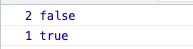

# `Scheduler`调度

`Watcher.prototype.update`中`queueWatcher`函数，也是线上环境自定义`watcher`肯定调用的分支：如果不是`lazy watcher`、不需要同步执行`watcher`，那么`watcher`将进入一个队列函数`queueWatcher`：

## 1、`queueWatcher`函数

## 1.1、变量的解释

```js
var MAX_UPDATE_COUNT = 100;
var queue = [];
var activatedChildren = [];
var has = {};
var circular = {};
var waiting = false;
var flushing = false;
var index = 0;
```

- MAX_UPDATE_COUNT：最大的更新次数
- queue：观察者队列，里面放的是`Watcher`实例
- activatedChildren：活动的子组件
- has：是否已经在队列中，一个以`watcher.id`为 key 的对象
- circular：循环调用的集合，一个以`watcher.id`为 key 的对象
- waiting：等待当前的队列执行完毕
- flushing：队列是否在**执行**过程中
- index：当然的数组下标

## 1.2、排队`Watcher`实例

```js
function queueWatcher(watcher) {
  var id = watcher.id;
  if (has[id] == null) {
    has[id] = true;
    if (!flushing) {
      queue.push(watcher);
    } else {
      var i = queue.length - 1;
      while (i > index && queue[i].id > watcher.id) {
        i--;
      }
      queue.splice(i + 1, 0, watcher);
    }
    if (!waiting) {
      waiting = true;
      if (!config.async) {
        flushSchedulerQueue();
        return;
      }
      nextTick(flushSchedulerQueue);
    }
  }
}
```

判断当前`watcher`是否加入到队列中，如果已经添加进入了队列中，即不做任何处理。

是否正在冲洗队列：

- 如果`flushing=true`，表示正在冲洗队列；因此插入到队列合适的位置：（`index`的递增在`flushSchedulerQueue`函数中，遍历执行队列中的`watcher.run`），在`$options.watch`定义的 cb 函数中操作有`watcher`绑定的字段会触发这种情况:

```js
// 配置
data() {
  return {
    test1: 22,
    test: 1234,
  };
},
watch: {
  test1() {},
  test() {
    this.test1 = 3;
  },
},
mounted() {
  this.test = 4;
},
// 源码注释
function queueWatcher(watcher) {
  var id = watcher.id;
  console.log(id, waiting);
  // ...
}
```

输出结果：



1. 队列下标`index <= i`的位置；（`i`从队列中最后一个元素开始。`index`从队列第一元素开始）。
2. 或者刚好比队列中**创建晚**的元素位置。（创建晚的`watcher.id`比较大）

所以包含以下两种情况：

1. 如果还没有超过当前的 id，那么这个`watcher`在队列等待；
2. 如果超过了当前的 id，那么会立即执行。

- 如果`flushing=false`，向队列添加这个`watcher`。

队列的冲洗过程是一次一次进行的。只有当`waiting=false`时，才可以进入到`flushSchedulerQueue`函数的执行，当然分两种情况：

- `config.async`为`false`，关掉异步的`watcher`队列的调度。同步执行队列意味造成性能的问题，针对于`Vue`测试工具的使用。
- 使用`nextTick`下个时间片执行`flushSchedulerQueue`。

综上，串一下执行过程，针对于线上的场景：
当设置一个值的时候，响应式`reactiveSetter`函数调用了`dep.notify`，然后遍历`dep.subs`调用了`watcher.update`方法，`watcher.update`内部调用了`queueWatcher`，将当前要执行的`watcher`添加到队列中，如果当前队列正在执行冲洗操作，那么会添加到当前的队列中执行，如果没有进行冲洗操作，直接`push`到队列中。

渲染`watcher`初始化时，由于没有调用`update`，并不会进入队列，因此调度排队只会发生在设置一个值得时候，当然`$forceUpdate`的调用除外，他会强制调用**渲染`watcher.update`**。

队列的执行不存在并行，只有一个队列执行结束，才会有下一个队列执行。

## 1.2、时间精度的问题

```js
var currentFlushTimestamp = 0;
function flushSchedulerQueue() {
  currentFlushTimestamp = getNow();
  flushing = true;
  var watcher, id;

  // Sort queue before flush.
  // This ensures that:
  // 1. Components are updated from parent to child. (because parent is always
  //    created before the child)
  // 2. A component's user watchers are run before its render watcher (because
  //    user watchers are created before the render watcher)
  // 3. If a component is destroyed during a parent component's watcher run,
  //    its watchers can be skipped.
  queue.sort(function(a, b) {
    return a.id - b.id;
  });

  // do not cache length because more watchers might be pushed
  // as we run existing watchers
  for (index = 0; index < queue.length; index++) {
    watcher = queue[index];
    if (watcher.before) {
      watcher.before();
    }
    id = watcher.id;
    has[id] = null;
    watcher.run();
    // in dev build, check and stop circular updates.
    if (has[id] != null) {
      circular[id] = (circular[id] || 0) + 1;
      if (circular[id] > MAX_UPDATE_COUNT) {
        warn(
          "You may have an infinite update loop " +
            (watcher.user
              ? 'in watcher with expression "' + watcher.expression + '"'
              : "in a component render function."),
          watcher.vm
        );
        break;
      }
    }
  }

  // keep copies of post queues before resetting state
  var activatedQueue = activatedChildren.slice();
  var updatedQueue = queue.slice();

  resetSchedulerState();

  // call component updated and activated hooks
  callActivatedHooks(activatedQueue);
  callUpdatedHooks(updatedQueue);

  // devtool hook
  /* istanbul ignore if */
  if (devtools && config.devtools) {
    devtools.emit("flush");
  }
}
```

`flushSchedulerQueue`冲洗调度队列。

1. 设置开始冲洗队列`flushing = true`。首先要做的是依据`watcher.id`排序整个`watcher`，`watcher.id`是自增的，排序的目的是：

   - 组件的更新是从父组件到子组件，因为父组件要先于子组件创建。
   - 一个组件的自定义`watcher`要先于渲染`watcher`，因为自定义`watcher`的创建在`initState`，渲染`watcher`在`Vue.prototype.$mount`创建。
   - 父组件的`watcher.run`中，如果一个组件被销毁，这个`watcher`会被跳过。

2. 遍历`watcher`队列，如果当前存在`watcher.before`，执行这个`watcher.before`；
3. 执行`watcher.run`，计算`value`并且执行`cb`回调。
4. `has`是用来判断当前`watcher`是否在调度队列中，`circular`判断循环调用次数，当一个`watcher.run`的次数超过`MAX_UPDATE_COUNT`，将会发出警告“是否存在 watcher 的循环调用”。
5. 获取`activatedChildren`，获取`updatedQueue`，调用`resetSchedulerState`重置调度任务状态：

```js
function resetSchedulerState() {
  index = queue.length = activatedChildren.length = 0;
  has = {};
  {
    circular = {};
  }
  waiting = flushing = false;
}
```

`queue.length = activatedChildren.length = 0`，可以通过设置数组长度为`0`，来达到清空数组的目的。`index = 0`，`has = {}`，`circular = {}`，`waiting = flushing = false`

6. 调用 hook:`callActivatedHooks`和`callUpdatedHooks`

```js
function callActivatedHooks(queue) {
  for (var i = 0; i < queue.length; i++) {
    queue[i]._inactive = true;
    activateChildComponent(queue[i], true /* true */);
  }
}
function activateChildComponent(vm, direct) {
  if (direct) {
    vm._directInactive = false;
    if (isInInactiveTree(vm)) {
      return;
    }
  } else if (vm._directInactive) {
    return;
  }
  if (vm._inactive || vm._inactive === null) {
    vm._inactive = false;
    for (var i = 0; i < vm.$children.length; i++) {
      activateChildComponent(vm.$children[i]);
    }
    callHook(vm, "activated");
  }
}
function callUpdatedHooks(queue) {
  var i = queue.length;
  while (i--) {
    var watcher = queue[i];
    var vm = watcher.vm;
    if (vm._watcher === watcher && vm._isMounted && !vm._isDestroyed) {
      callHook(vm, "updated");
    }
  }
}
```

`callActivatedHooks`遍历设置`vm._directInactive = true`，调用`activateChildComponent`激活子组件的状态。
`callUpdatedHooks`遍历调用`hook:updated`

7. 通知`devtool`。

```js
function queueActivatedComponent(vm) {
  // setting _inactive to false here so that a render function can
  // rely on checking whether it's in an inactive tree (e.g. router-view)
  vm._inactive = false;
  activatedChildren.push(vm);
}
```
