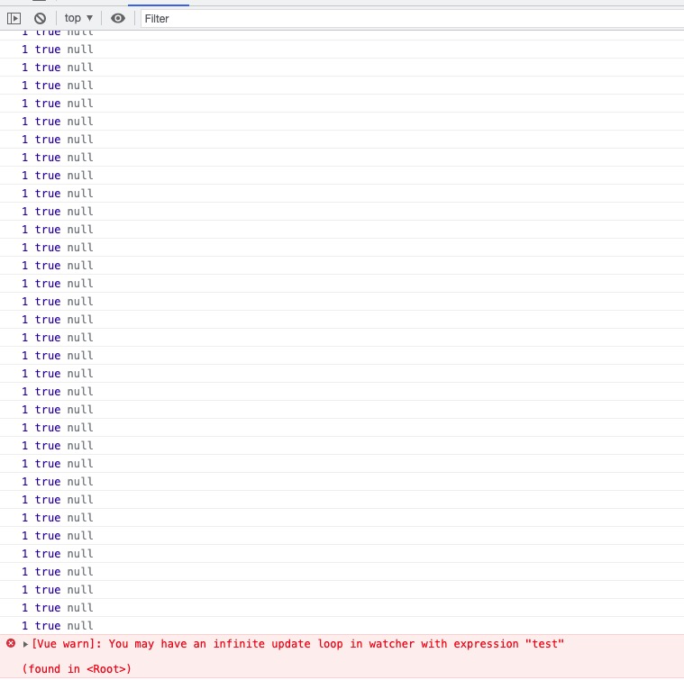

# `Scheduler`调度

`Watcher.prototype.update`中`queueWatcher`函数，也是线上环境自定义`watcher`肯定调用的分支：如果不是`lazy watcher`、不需要同步执行`watcher`，那么`watcher`将进入一个队列函数`queueWatcher`：

## 1、`queueWatcher`函数

变量的解释：

```js
var MAX_UPDATE_COUNT = 100;
var queue = [];
var activatedChildren = [];
var has = {};
var circular = {};
var waiting = false;
var flushing = false;
var index = 0;
```

- `MAX_UPDATE_COUNT`：最大的更新次数
- `queue`：观察者队列，里面放的是`Watcher`实例
- `activatedChildren`：活动的子组件
- `has`：是否已经在队列中，一个以`watcher.id`为 key 的对象
- `circular`：循环调用的集合，一个以`watcher.id`为 key 的对象
- `waiting`：等待当前的队列执行完毕
- `flushing`：队列是否在**执行**过程中
- `index`：当然的数组下标

```js
function queueWatcher(watcher) {
  var id = watcher.id;
  if (has[id] == null) {
    has[id] = true;
    if (!flushing) {
      queue.push(watcher);
    } else {
      var i = queue.length - 1;
      while (i > index && queue[i].id > watcher.id) {
        i--;
      }
      queue.splice(i + 1, 0, watcher);
    }
    if (!waiting) {
      waiting = true;
      if (!config.async) {
        flushSchedulerQueue();
        return;
      }
      nextTick(flushSchedulerQueue);
    }
  }
}
```

判断当前`watcher`是否加入到队列中，如果已经添加进入了队列中，即不做任何处理。

如果没有加入，那么要添加到队列，添加队列需要判断*是否处于冲洗队列中*：如果`flushing=false`，说明没有在冲洗队列，即向队列添加这个`watcher`。如果正在冲洗队列中，就相对复杂一些。

### 1.2.1、队列冲洗中

如果`flushing=true`，表示正在冲洗队列。当在`$options.watch`定义的 cb 函数中操作有`watcher`绑定的字段会触发这种情况：

```js
// 配置
data() {
  return {
    test1: 22,
    test: 1234,
  };
},
watch: {
  test1() {},
  test() {
    this.test1 = 3;
  },
},
mounted() {
  this.test = 4;
},
// vue 源码中
function queueWatcher(watcher) {
  var id = watcher.id;
  console.log(id, waiting);
  // ...
}
```

输出结果：

  

此前置条件：已经存在一个排序好的队列在遍历执行`watcher.run`。cb 中再次触发`queueWatcher`。

使用一个倒序循环查找应该插入的位置；在代码中判断的条件：

1. 队列数组下标`i == index`跳出循环（`i`从队列中最后一个元素开始。`index`从队列第一元素开始；`index`的递增在`flushSchedulerQueue`函数中，遍历执行队列中的`watcher.run`），这个条件可以找到当前正在执行的`watcher`位置。
2. 进入这个条件，肯定是`i > index`。判断`queue[i].id < watcher.id`跳出循环，意味着队列的第`i`的`watcher`早于 传入`watcher`创建。

例子 1 `i == index`跳出

```
传入 watcher{id:2}
-----------------------
queue    [watcher{id:1}]
               ^
数组下标      index、i
-----------------------
拼接操作 queue.splice(i + 1, 0, watcher)
-----------------------
queue    [watcher{id:1}, watcher{id:2}]
```

例子 2 `queue[i].id < watcher.id`跳出

```
传入 watcher{id:3}
-----------------------
queue    [watcher{id:1}, watcher{id:2}, watcher{id:4}]
              ^                             ^
数组下标     index                           i
-----------------------
queue    [watcher{id:1}, watcher{id:2}, watcher{id:4}]
              ^                 ^
数组下标     index               i
-----------------------
拼接操作 queue.splice(i + 1, 0, watcher)
-----------------------
queue    [watcher{id:1}, watcher{id:2}, watcher{id:3}, watcher{id:4}]
```

所以总结为：

1. 新一轮的`queueWatcher`是当前`index`的`watcher.run`时触发的，那么它肯定要晚于当前的`index`的位置；
2. `watcher`的`id`根据`new`的时机增序设置的，所以 id 小的要排在 id 大的前面。

### 1.2.2、开始冲洗

**队列的冲洗过程是一次一次进行的。**

队列的执行不存在并行，只有一个队列执行结束，才会有下一个队列执行。只有当`waiting=false`时，才执行`flushSchedulerQueue`函数，然分两种情况：

- `config.async`为`false`，关掉异步的`watcher`队列的调度。针对于`Vue`测试工具的使用，当然同步执行队列会造成性能问题。
- 使用`nextTick`下个时间片执行`flushSchedulerQueue`。

渲染`watcher`初始化时，由于没有调用`update`，并不会进入队列，因此调度排队只会发生在设置一个值得时候，当然`$forceUpdate`的调用除外，他会强制调用**渲染`watcher.update`**。

### 1.2.3、流程总结

综上，串一下执行过程，针对于线上的场景：
当设置一个值的时候，响应式`reactiveSetter`函数调用了`dep.notify`，然后遍历`dep.subs`调用了`watcher.update`方法，`watcher.update`内部调用了`queueWatcher`，将当前要执行的`watcher`添加到队列中，如果当前队列正在执行冲洗操作，那么会添加到当前的队列中执行，如果没有进行冲洗操作，直接`push`到队列中。

一个`watcher`的回调里面触发的另外一个`watcher`的执行，会在同一次冲洗队列中完成冲洗。也是在同一个时间片中完成冲洗。

## 2、`flushSchedulerQueue`函数

```js
var currentFlushTimestamp = 0;
function flushSchedulerQueue() {
  currentFlushTimestamp = getNow();
  flushing = true;
  var watcher, id;
  queue.sort(function(a, b) {
    return a.id - b.id;
  });
  for (index = 0; index < queue.length; index++) {
    watcher = queue[index];
    if (watcher.before) {
      watcher.before();
    }
    id = watcher.id;
    has[id] = null;
    watcher.run();
    // in dev build, check and stop circular updates.
    if (has[id] != null) {
      circular[id] = (circular[id] || 0) + 1;
      if (circular[id] > MAX_UPDATE_COUNT) {
        warn(
          "You may have an infinite update loop " +
            (watcher.user
              ? 'in watcher with expression "' + watcher.expression + '"'
              : "in a component render function."),
          watcher.vm
        );
        break;
      }
    }
  }
  // console.log(queue.length) 标记1

  // keep copies of post queues before resetting state
  var activatedQueue = activatedChildren.slice();
  var updatedQueue = queue.slice();

  resetSchedulerState();

  // call component updated and activated hooks
  callActivatedHooks(activatedQueue);
  callUpdatedHooks(updatedQueue);

  // devtool hook
  /* istanbul ignore if */
  if (devtools && config.devtools) {
    devtools.emit("flush");
  }
}
```

### 2.1、排序、执行

设置开始冲洗队列`flushing = true`，意味着后续的`watcher`进入`queueWatcher`函数，会进入`1.2.1、队列冲洗中`章节插入进正在执行队列的逻辑。

首先要做的是依据`watcher.id`排序整个`watcher`，`watcher.id`是自增的，排序的目的是：

- 组件的更新是从父组件到子组件，因为父组件要先于子组件创建。
- 一个组件的自定义`watcher`要先于渲染`watcher`，因为自定义`watcher`的创建在`initState`，渲染`watcher`在`Vue.prototype.$mount`创建。
- 父组件的`watcher`回调中，将一个子组件被销毁，这个子组件的`watcher`会被跳过。比如我们使用`v-if`判断组件是否渲染，在父组件设置为`false`，那么子组件将被销毁。

队列的`length`不会被缓存，因为在`queueWatcher`函数很有可能向正在遍历的队列数组添加元素。

遍历队列，执行队列中`watcher`的`before`，如果当前的`watcher`是一个渲染`watcher`，那么在`before`函数中，会调用`hook:beforeUpdate`，然后将`has[id]`重置，那么意味在`watcher.run`中可以将当前的`watcher`再次排队。

```js
// 配置
  data() {
    return {
      test: 1234,
    };
  },
  watch: {
    test() {
      this.test = 3;
    },
  },
  mounted() {
    this.test = 4;
  }
  // vue 源码中
  function queueWatcher(watcher) {
    var id = watcher.id;
    if (has[id] == null) {
      console.log(id, waiting, has[id]);
      ///
    }
  }
```

输出结果：

```js
// console
// 1 false undefined
// 1 true null   ===》如果删掉has[id] = null 或者 和`watcher.run();`调换位置，不会有这条打印
```

上面的做法可能会导致的问题是循环调用:

```js
  data() {
    return {
      test: 1234,
    };
  },
  watch: {
    test() {
      this.test++;
    },
  },
  mounted() {
    this.test = 4;
  },
  // vue 源码中
  function queueWatcher(watcher) {
    var id = watcher.id;
    if (has[id] == null) {
      console.log(id, waiting, has[id]);
      ///
    }
  }
```

输出结果：



执行完`has[id] = null`之后，当前的`watcher`可以再次排队，`queueWatcher`中执行`has[id] = true`，这样无限在`queueWatcher` => `watcher.run`间进行循环调用，当达到`MAX_UPDATE_COUNT`将发出警告且直接跳出循环。（这个地方的循环调用是数组的迭代，执行完一个`watcher`之后，会在队列数组又添加一个，所以使用`break`可以跳出。不是递归。上述源代码的标记 1 处，会打印 102 个，队列有 102 个`watcher`）。无论是数组遍历结束，还是`break`跳出至此队列执行完毕。

### 2.2、执行之后

```js
const activatedQueue = activatedChildren.slice();
const updatedQueue = queue.slice();
resetSchedulerState();
callActivatedHooks(activatedQueue);
callUpdatedHooks(updatedQueue);
```

缓存重置之前的两个队列：

1. activatedQueue：通过`queueActivatedComponent`函数存放`keep-alive`组件的数组。在`keep-alive`讨论。
2. updatedQueue：当前的队列

调用`resetSchedulerState();`来重置执行队列之后的状态

```js
function resetSchedulerState() {
  index = queue.length = activatedChildren.length = 0;
  has = {};
  {
    circular = {};
  }
  waiting = flushing = false;
}
```

- 重置`index`
- 清空队列
- 清空`activatedChildren`
- 清空存在队列中的标识
- 清空循环调用辅助字段
- 设置不处于队列冲洗阶段标识

接下来调用 hook`callActivatedHooks`在`keep-alive`讨论。调用 hook`callUpdatedHooks`：

```js
function callUpdatedHooks(queue) {
  let i = queue.length;
  while (i--) {
    const watcher = queue[i];
    const vm = watcher.vm;
    if (vm._watcher === watcher && vm._isMounted && !vm._isDestroyed) {
      callHook(vm, "updated");
    }
  }
}
```

调用之前缓存的队列，获取`watcher.vm`可以拿到当前的`Vue`实例，有几个情况：

- 是一个渲染`watcher`
- 真实 Dom 已经挂载
- 没有被销毁

满足上面三个条件才会执行`hook:updated`，一个`vm`只有一个渲染`watcher`，所以一个`vm`只会触发一次。因为和渲染`watcher`绑定，所以有些情况不会触发`hook:updated`。（官方文档：https://cn.vuejs.org/v2/api/#updated）。

```js
  data() {
    return {
      test: 1234,
    };
  },
  watch: {
    test() {
      console.log(this.test);
    },
  },
  updated() {
    console.log(`不会打印，因为和渲染watcher绑定`);
  },
  mounted() {
    this.test = 4;
  },
  template: `<div>111</div>`,
```

整个`flushSchedulerQueue`在下一个时间片执行，`flushSchedulerQueue`和视图的渲染在一个宏任务执行，因此`hook:updated`调用时，真实 dom 已经更新了。

最后通知`devtool`。
