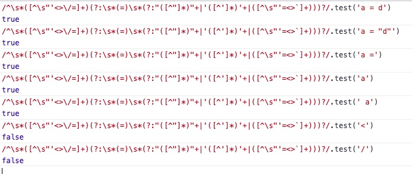

# html-parser

Vue 针对于模板文件的解析，使用了一个开源库实现`html-parser`，来自于`John Resig`的一篇博客https://johnresig.com/blog/pure-javascript-html-parser/。`John Resig`也是`jquery`的创建者。

大体的背景是，在`John Resig`开荒时期，他所能找到的是`Erik Arvidsson`开发的一个简单的`SAX风格的HTML解析器`，但是仅仅考虑到最基本的解析，没有实现复杂的 HTML 逻辑。`John Resig`曾考虑移植`HTML解析器`，但是一个艰巨的任务。于是他开发了`htmlparser.js`，虽然不能和`htmllib`的合规性相匹配，也无法与纯`XML`解析器的速度相提并论，但是能够胜任功能，并且有较高的可移植性。

代码地址：https://johnresig.com/files/htmlparser.js

下面具体看 Vue 实现

## 1、各种正则

### 1.1、静态属性正则

```js
const attribute = /^\s*([^\s"'<>\/=]+)(?:\s*(=)\s*(?:"([^"]*)"+|'([^']*)'+|([^\s"'=<>`]+)))?/;
```

- `^\s*`为不可见字符的正则，大多数情况下是空格，开始位置可能存在空格

- 匹配组一`([^\s"'<>\/=]+)`不匹配不可见字符、`"`、`'`、`<`、`>`、`/`、`=`
- 匹配组二`` (?:\s*(=)\s*(?:"([^"]*)"+|'([^']*)'+|([^\s"'=<>`]+))) ``
  - `?:`匹配不收集
  - `\s*(=)\s*`等号前后有可能会有空字符
  - `?:`匹配不收集`` "([^"]*)"+|'([^']*)'+|([^\s"'=<>`]+) ``以下是**或**的逻辑
    - `"([^"]*)"+`表示匹配`"xxx"`的情况
    - `'([^']*)'+`表示匹配`'xxx'`的情况
    - `` ([^\s"'=<>`]+) ``表示不匹配不可见字符、`"`、`'`、`<`、`>`、`` ` ``、`=`
- `?`表示`` (?:\s*(=)\s*(?:"([^"]*)"+|'([^']*)'+|([^\s"'=<> `]+))) ``存不存在

综上匹配的是`xxx = "xxx"`这种属性，可以是以下的情况

- `attribute = "123"`
- `attribute = '123'`
- `attribute = 123`

（ps：上面的空格有没有都可以）

测试打印如下：



### 1.2、动态属性正则

```js
const dynamicArgAttribute = /^\s*((?:v-[\w-]+:|@|:|#)\[[^=]+\][^\s"'<>\/=]*)(?:\s*(=)\s*(?:"([^"]*)"+|'([^']*)'+|([^\s"'=<>`]+)))?/;
```

- `^\s*`为不可见字符的正则，大多数情况下是空格，开始位置可能存在空格
- 匹配组一`((?:v-[\w-]+:|@|:|#)\[[^=]+\][^\s"'<>\/=]*)`
  - `(?:v-[\w-]+:|@|:|#)`:
    - 匹配`v-`接`[A-Za-z0-9_-]`的字符，然后接`:`，例如：`v-slot:`针对于指令
    - 或 匹配`@`，针对于事件
    - 或 匹配`:`，针对于 prop
    - 或 匹配`#`，针对于具名插槽（v-slot 也有缩写，即把参数之前的所有内容 (v-slot:) 替换为字符 #。例如 v-slot:header 可以被重写为 #header）
  - `\[[^=]+\][^\s"'<>\/=]*)`
- 匹配组二`(?:\s*(=)\s*(?:"([^"]*)"+|'([^']*)'+|([^\s"'=<>`]+)))`，同上面一样
- `?`表示`` (?:\s*(=)\s*(?:"([^"]*)"+|'([^']*)'+|([^\s"'=<>`]+))) ``存不存在

综上匹配的是`v-slot:xxx=""`或者`@click="xxx"`或者`:xxxx="xxx"`

### 1.2、`qnameCapture`

```js
// unicode集
const unicodeRegExp = /a-zA-Z\u00B7\u00C0-\u00D6\u00D8-\u00F6\u00F8-\u037D\u037F-\u1FFF\u200C-\u200D\u203F-\u2040\u2070-\u218F\u2C00-\u2FEF\u3001-\uD7FF\uF900-\uFDCF\uFDF0-\uFFFD/;

const ncname = `[a-zA-Z_][\\-\\.0-9_a-zA-Z${unicodeRegExp.source}]*`;
const qnameCapture = `((?:${ncname}\\:)?${ncname})`;
```

- `ncname`：
  - `[a-zA-Z_]`表示匹配以字母和下划线的字符
  - `[\\-\\.0-9_a-zA-Z${unicodeRegExp.source}]*`匹配整个`unicode`字符集

至少两个字符

- `qnameCapture`：
  计算之后的值：

  ```js
  var qnameCapture =
    "((?:[a-zA-Z_][-.0-9_a-zA-Za-zA-Z\u00B7\u00C0-\u00D6\u00D8-\u00F6\u00F8-\u037D\u037F-\u1FFF\u200C-\u200D\u203F-\u2040\u2070-\u218F\u2C00-\u2FEF\u3001-\uD7FF\uF900-\uFDCF\uFDF0-\uFFFD]*:)?[a-zA-Z_][-.0-9_a-zA-Za-zA-Z\u00B7\u00C0-\u00D6\u00D8-\u00F6\u00F8-\u037D\u037F-\u1FFF\u200C-\u200D\u203F-\u2040\u2070-\u218F\u2C00-\u2FEF\u3001-\uD7FF\uF900-\uFDCF\uFDF0-\uFFFD]*)";
  ```

### 1.3、`startTagOpen`

```js
const startTagOpen = new RegExp(`^<${qnameCapture}`);
```

正则`startTagOpen`，打印之后为：

```js
/^<((?:[a-zA-Z_][-.0-9_a-zA-Za-zA-Z·À-ÖØ-öø-ͽͿ-῿‌-‍‿-⁀⁰-↏Ⰰ-⿯、-퟿豈-﷏ﷰ-�]*:)?[a-zA-Z_][-.0-9_a-zA-Za-zA-Z·À-ÖØ-öø-ͽͿ-῿‌-‍‿-⁀⁰-↏Ⰰ-⿯、-퟿豈-﷏ﷰ-�]*)/;
```

所以开始标签：

- 必须以`<`开始
- `<`之后字符必须以字母和下划线开始，也就是标签命开始必须是字母或者下划线
- 可以使用`<lib:xxx`这种`XML`命名空间的标签

### 1.4、`startTagClose`

```js
var startTagClose = /^\s*(\/?)>/;
```

开始的闭合标签

- `/>`，例如`<br />`等
- `>`，例如`<div></div>`等

### 1.5、`endTag`

```js
var endTag = new RegExp("^<\\/" + qnameCapture + "[^>]*>");
```

结束标签 以 `</xxx>`，xxx 为`qnameCapture`的正则规则字符串。

### 1.6、`doctype`

```js
var doctype = /^<!DOCTYPE [^>]+>/i;
```

匹配`DOCTYPE`，比如`<!DOCTYPE html>`

### 1.7、`comment`

```js
var comment = /^<!\--/;
```

匹配 html 注释`<!--xxxxx-->`，为什么是`\--`，而不是`--`，是安卓 webview 的一个兼容问题:https://github.com/vuejs/vue/issues/7298，在html中注入脚本如果使用`<!--`将直接被解析，但是`<!\--`不会被解析。

### 1.8、`conditionalComment`

```js
var conditionalComment = /^<!\[/;
```

匹配条件注释：

```html
<!--[if !IE]>-->
<link href="non-ie.css" rel="stylesheet" />
<!--<![endif]-->
```

相关内容：https://zh.wikipedia.org/wiki/%E6%9D%A1%E4%BB%B6%E6%B3%A8%E9%87%8A

## 2、变量

### 2.1、`isPlainTextElement`

```js
// Special Elements (can contain anything)
var isPlainTextElement = makeMap("script,style,textarea", true);
var reCache = {};
```

`makeMap`函数是将一个以`,`隔开的字符串，处理成一个对象集合的高阶函数，返回一个函数。

```js
isPlainTextElement("script"); // output: true
isPlainTextElement(""); // output: undefined
```

### 2.2、`decodingMap`

定义一组转义的对象集合。

```js
var decodingMap = {
  "&lt;": "<",
  "&gt;": ">",
  "&quot;": '"',
  "&amp;": "&",
  "&#10;": "\n",
  "&#9;": "\t",
  "&#39;": "'",
};
```

### 2.3、`encodedAttr`

```js
var encodedAttr = /&(?:lt|gt|quot|amp|#39);/g;
var encodedAttrWithNewLines = /&(?:lt|gt|quot|amp|#39|#10|#9);/g;
```

`encodedAttr`匹配不收集`<`、`>`、`"`、`&`、`'`
`encodedAttrWithNewLines`匹配不收集`<`、`>`、`"`、`&`、`'`、`\n`、`\t`

为了好理解，将转义字符转换为原始字符，为了看懂意义。

### 2.4、 `isIgnoreNewlineTag`

```js
var isIgnoreNewlineTag = makeMap("pre,textarea", true);
```

```js
isIgnoreNewlineTag("pre"); // output: true
isIgnoreNewlineTag(""); // output: undefined
```

### 2.5、`shouldIgnoreFirstNewline`

```js
var shouldIgnoreFirstNewline = function(tag, html) {
  return tag && isIgnoreNewlineTag(tag) && html[0] === "\n";
};
```

传入一个 tag 名称，如果是"忽略新的一行标签"，并且 `html[0] === "\n"`，返回`true`

### 2.6、`decodeAttr`

```js
function decodeAttr(value, shouldDecodeNewlines) {
  var re = shouldDecodeNewlines ? encodedAttrWithNewLines : encodedAttr;
  return value.replace(re, function(match) {
    return decodingMap[match];
  });
}
```

高阶函数，是否需要在`decode`存在折行的属性，使用不同的正则。如果是存在这行，正则就会多`\n`、`\t`两个字符。然后将转义的字符解析为非转义的字符。

### 2.7、`isNonPhrasingTag`

```js
var isNonPhrasingTag = makeMap(
  "address,article,aside,base,blockquote,body,caption,col,colgroup,dd," +
    "details,dialog,div,dl,dt,fieldset,figcaption,figure,footer,form," +
    "h1,h2,h3,h4,h5,h6,head,header,hgroup,hr,html,legend,li,menuitem,meta," +
    "optgroup,option,param,rp,rt,source,style,summary,tbody,td,tfoot,th,thead," +
    "title,tr,track"
);
```

## 3、`parseHTML`

```js
function parseHTML(html, options) {
  // 栈
  var stack = [];
  var expectHTML = options.expectHTML;
  var isUnaryTag$$1 = options.isUnaryTag || no;
  var canBeLeftOpenTag$$1 = options.canBeLeftOpenTag || no;
  var index = 0;
  var last, lastTag;
  while (html) {
    // 缓存一个上次的html标签
    last = html;
    // Make sure we're not in a plaintext content element like script/style
    // 上一个tag如果不存在  或者 不是 script、style、textarea 标签
    if (!lastTag || !isPlainTextElement(lastTag)) {
      // 获取`<`的位置，
      var textEnd = html.indexOf("<");
      // 如果是 0 说明输入的 html 字符串的第一个字符就是一个标签的开始
      if (textEnd === 0) {
        // Comment:
        // 判断当前是不是一个注释 /^<!\--/.test
        if (comment.test(html)) {
          // 获取`-->`的位置
          var commentEnd = html.indexOf("-->");
          // 如果找到了，那么对这个注释进行操作
          if (commentEnd >= 0) {
            // 当前解析是否需要保留 注释内容，如果是真，那么使用传入的 comment的方法 处理这个字符
            // 使用了 html.substring(4, commentEnd),截取了`<!--`到`-->`的字符串
            // 传入这个注释 开始的位置 index
            // 传入这个注释 结束的位置 index + commentEnd + 3
            if (options.shouldKeepComment) {
              options.comment(
                html.substring(4, commentEnd),
                index,
                index + commentEnd + 3
              );
            }
            // 调用当前 advance 函数，这个函数执行了
            // index += n; 更新当前 index的位置，
            // html = html.substring(n); 获取 截取从注释结尾 开始的字符串
            advance(commentEnd + 3);
            // 继续执行
            continue;
          }
        }

        // http://en.wikipedia.org/wiki/Conditional_comment#Downlevel-revealed_conditional_comment
        // 使用上面同样的代码逻辑
        // 条件注释的匹配 判断 html 开头位置是否为 条件注释
        if (conditionalComment.test(html)) {
          // 获取条件注释的末尾标签位置
          var conditionalEnd = html.indexOf("]>");
          // 如果 找到了 那么开始处理
          if (conditionalEnd >= 0) {
            // 更新 index 和 字符串 html，这里的操作是直接忽略掉这个 条件注释标签
            advance(conditionalEnd + 2);
            continue;
          }
        }

        // 处理 Doctype:
        // 判断是否是 开头位置是不是 doctype，如果是，同样更新index 和 字符串 html
        // 这里的操作同样是直接忽略掉这个 doctype 标签
        var doctypeMatch = html.match(doctype);
        if (doctypeMatch) {
          advance(doctypeMatch[0].length);
          continue;
        }

        // End tag:
        // 判断结束标签
        var endTagMatch = html.match(endTag);
        // 如果html 开头位置为一个`</xxx >`
        if (endTagMatch) {
          // 缓存当前的index
          var curIndex = index;
          // 更新 index 和 html
          advance(endTagMatch[0].length);
          // 调用 parseEndTag，传入 匹配的tag  当前 index， 结束标签的末尾位置 index
          // endTagMatch[1] 为匹配组的内容就是当前的 tagname
          parseEndTag(endTagMatch[1], curIndex, index);
          continue;
        }

        // Start tag:
        // 通过parseStartTag获取了一个 match对象
        var startTagMatch = parseStartTag();
        if (startTagMatch) {
          // 处理开始的标签
          handleStartTag(startTagMatch);
          // 是否忽略第一行，看是否是 pre、textarea 并且 第一行有\n，如果是就设置 index = 1,并且更新html，跳过当前的标签
          if (shouldIgnoreFirstNewline(startTagMatch.tagName, html)) {
            advance(1);
          }
          continue;
        }
      }
      // 设置 text,rest,next 为 undefined
      var text = void 0,
        rest = void 0,
        next = void 0;

      // 如果textEnd
      if (textEnd >= 0) {
        // 分割字符串，获取剩下的字符串
        rest = html.slice(textEnd);
        // 判断 如果不是结束的tag
        // 不是开始的打开标签
        // 不是注释标签
        // 不是条件判断标签
        while (
          !endTag.test(rest) &&
          !startTagOpen.test(rest) &&
          !comment.test(rest) &&
          !conditionalComment.test(rest)
        ) {
          // < in plain text, be forgiving and treat it as text
          // 从第一位往后查找 < 的位置，为下一个 textEnd 的 位置
          next = rest.indexOf("<", 1);
          // 如果没有找到，直接跳出
          if (next < 0) {
            break;
          }
          // 否则获取当前的位置
          textEnd += next;
          // 更新剩下的字符串
          rest = html.slice(textEnd);
        }
        // 分割当前的这部分内容作为 文本节点的内容
        text = html.substring(0, textEnd);
      }

      // 如果 textEnd 小于 0 说明没有找到 <  当然是一个文本节点
      if (textEnd < 0) {
        text = html;
      }

      // 如果上面的两个方法找到了text，更新 index 和 html
      if (text) {
        advance(text.length);
      }

      // 是否设置了 chars 的处理方法 和 test
      if (options.chars && text) {
        options.chars(text, index - text.length, index);
      }
    } else {
      // lastTag 不为空时
      // 设置endTagLength = 0
      var endTagLength = 0;
      // 获取lastTag的小写
      var stackedTag = lastTag.toLowerCase();
      // 动态设置一个 lastTag的关闭标签，非贪婪 匹配了里面的 可见和不可见的字符
      var reStackedTag =
        reCache[stackedTag] ||
        (reCache[stackedTag] = new RegExp(
          "([\\s\\S]*?)(</" + stackedTag + "[^>]*>)",
          "i"
        ));
      // 替换这个内容
      var rest$1 = html.replace(reStackedTag, function(all, text, endTag) {
        // all 是 所有的匹配上的字符，text是匹配组一的字符串，endTag是匹配组二的字符串
        // endTag的长度 是 endTag的长度
        endTagLength = endTag.length;
        // 判断  不是一个纯文本节点，并且 stackedTag 不是 noscript
        if (!isPlainTextElement(stackedTag) && stackedTag !== "noscript") {
          // 文本的内容 是匹配组一的内容，特殊处理 注释 和 CDATA标签的内容
          text = text
            .replace(/<!\--([\s\S]*?)-->/g, "$1") // #7298
            .replace(/<!\[CDATA\[([\s\S]*?)]]>/g, "$1");
        }
        // 如果是 pre 或者 textarea
        if (shouldIgnoreFirstNewline(stackedTag, text)) {
          text = text.slice(1);
        }
        // 处理文本的内容
        if (options.chars) {
          options.chars(text);
        }
        return "";
      });
      // 更新index, html
      index += html.length - rest$1.length;
      html = rest$1;
      // 解析结束的标签
      parseEndTag(stackedTag, index - endTagLength, index);
    }

    // 如果当前的html 和 上次的 html 相同，说明模板结束标签的格式出现了错误
    if (html === last) {
      options.chars && options.chars(html);
      if (!stack.length && options.warn) {
        options.warn('Mal-formatted tag at end of template: "' + html + '"', {
          start: index + html.length,
        });
      }
      break;
    }
  }

  // Clean up any remaining tags
  // 清空任何的tag
  parseEndTag();

  function advance(n) {
    index += n;
    html = html.substring(n);
  }

  // 解析当前的开始标签
  function parseStartTag() {
    // 调用startTagOpen正则来解析 当前的 html 开头位置 是否是一个 元素 类型的标签
    var start = html.match(startTagOpen);
    // 如果是
    if (start) {
      // 定义一个对象，来保存刚刚匹配的数据， start[1]获取的是当前的标签类型，index是当前解析的位置
      var match = {
        tagName: start[1],
        attrs: [],
        start: index,
      };
      // 更新当前的 index 位置信息 和 截取 html 字段串
      advance(start[0].length);
      var end, attr;
      // 下面做的事情是获取当前标签的 属性 和 动态的属性
      // 循环条件是 没有匹配到开始标签的关闭字符`>`，并且存在动态或者静态的属性
      while (
        !(end = html.match(startTagClose)) &&
        (attr = html.match(dynamicArgAttribute) || html.match(attribute))
      ) {
        // attr 开始位置
        attr.start = index;
        // 更新 index 和 html
        advance(attr[0].length);
        // attr 结束位置
        attr.end = index;
        // 放入上面定义的match 的 attrs 的数组中
        match.attrs.push(attr);
      }
      // 当跳出上面循环之后，end是有匹配值的
      if (end) {
        // 设置 unarySlash 字段为 end[1]，end[1]是当前匹配组的 / ，标识 当前是一个 空元素 https://developer.mozilla.org/zh-CN/docs/Glossary/Empty_element，所以unarySlash 标识是否是一个空元素
        match.unarySlash = end[1];
        // 更新index 和 html
        advance(end[0].length);
        // 设置结束的位置
        match.end = index;
        返回 match
        return match;
        // 综上 match是这样一个数据结构
        // {
        //   tagName: start[1],
        //   unarySlash: '/',
        //   attrs: [],
        //   start: index,
        //   end:
        // };
      }
    }
  }

  function handleStartTag(match) {
    // 获取 tagName 和 空标签标识
    var tagName = match.tagName;
    var unarySlash = match.unarySlash;

    // 如果上一个标签是P，并且 是 一个非空标签，查找标签的终点
    if (expectHTML) {
      if (lastTag === "p" && isNonPhrasingTag(tagName)) {
        parseEndTag(lastTag);
      }
      // 左开标签  上次的tag 和 tagName相同，查找标签的终点
      if (canBeLeftOpenTag$$1(tagName) && lastTag === tagName) {
        parseEndTag(tagName);
      }
    }

    // 是否是空标签
    var unary = isUnaryTag$$1(tagName) || !!unarySlash;

    var l = match.attrs.length;
    var attrs = new Array(l);
    for (var i = 0; i < l; i++) {
      var args = match.attrs[i];
      var value = args[3] || args[4] || args[5] || "";
      // 如果是href标签需要 解析转义字符
      var shouldDecodeNewlines =
        tagName === "a" && args[1] === "href"
          ? options.shouldDecodeNewlinesForHref
          : options.shouldDecodeNewlines;
       // 为当前当前的attr设置属性name和value
      attrs[i] = {
        name: args[1],
        value: decodeAttr(value, shouldDecodeNewlines),
      };
      // 如果输入资源范围，设置attr的start 和 end
      if (options.outputSourceRange) {
        attrs[i].start = args.start + args[0].match(/^\s*/).length;
        attrs[i].end = args.end;
      }
    }

    // 如果不是空标签，放入栈中回去查找它对应的关闭标签
    if (!unary) {
      stack.push({
        tag: tagName,
        lowerCasedTag: tagName.toLowerCase(),
        attrs: attrs,
        start: match.start,
        end: match.end,
      });
      lastTag = tagName;
    }
    // 设置开始标签
    if (options.start) {
      options.start(tagName, attrs, unary, match.start, match.end);
    }
  }

  // 解析结束的标签
  // 参数 标签名称 、 开始的位置 、 结束的位置
  function parseEndTag(tagName, start, end) {
    var pos, lowerCasedTagName;
    if (start == null) {
      start = index;
    }
    if (end == null) {
      end = index;
    }

    // Find the closest opened tag of the same type
    // 如果标签名存在
    if (tagName) {
      // 标签名 标准都是小写的
      lowerCasedTagName = tagName.toLowerCase();
      // 从后向前查找 栈中 和当前标签 相同的标签
      for (pos = stack.length - 1; pos >= 0; pos--) {
        if (stack[pos].lowerCasedTag === lowerCasedTagName) {
          break;
        }
      }
    } else {
      // If no tag name is provided, clean shop
      pos = 0;
    }

    // 如果是有效的 位置
    if (pos >= 0) {
      // Close all the open elements, up the stack
      // 关闭所有打开的标签，直到栈顶
      // 从后向前遍历，并且 pos的位置作为判断条件
      for (var i = stack.length - 1; i >= pos; i--) {
        // 如果tagName不存在 并且 开启了提示，那么提示当前没有匹配的标签警告
        // 或者 i > pos
        if (i > pos || (!tagName && options.warn)) {
          options.warn("tag <" + stack[i].tag + "> has no matching end tag.", {
            start: stack[i].start,
            end: stack[i].end,
          });
        }
        // 如果 传入 end 的处理方法，那么执行 end方法。
        if (options.end) {
          options.end(stack[i].tag, start, end);
        }
      }

      // Remove the open elements from the stack
      // 通过数组的length方法来删除 数组中的项
      stack.length = pos;
      lastTag = pos && stack[pos - 1].tag;
      // 处理如果是 br 标签
    } else if (lowerCasedTagName === "br") {
      // 调用 start
      if (options.start) {
        options.start(tagName, [], true, start, end);
      }
      // 如果是 p 标签
    } else if (lowerCasedTagName === "p") {
      // 添加 开始 P
      if (options.start) {
        options.start(tagName, [], false, start, end);
      }
      // 添加 结束 P
      if (options.end) {
        options.end(tagName, start, end);
      }
    }
  }
}
```
