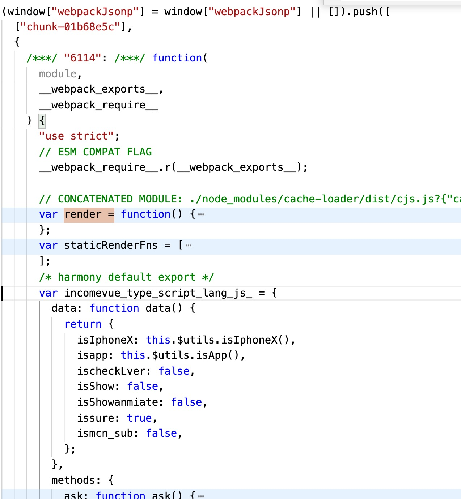

# createElement 函数

进入`initRender`之前，我们先来了解下`createElement`函数，因为`initRender`函数内部维护的很多属性都和`createElement`有关。

## 1、`vm.$options.render`函数

`vm.$options.render`函数的生成有三种方式：

1. 通过`webpack`编译`SFC`文件，生成的`render`函数，此外还有 `staticRenderFns`。如下截图：
   
2. 通过 \$options 属性，手写的`render` 函数 (https://cn.vuejs.org/v2/guide/render-function.html) ；
3. 通过 \$options 属性 template，runtime 时编译。

`$options.render`函数的第一个参数就是`vm.$createElement`。

```js
Vue.prototype._render = function() {
  var vm = this;
  var ref = vm.$options;
  var render = ref.render;
  //...
  vnode = render.call(vm._renderProxy, vm.$createElement);
  //...
};
```

由此可见，无论我们通过哪种方式生成`render`函数，最终都会调用`$createElement`去生成一个 Vnode。

## 2、vm.\$createElement

`vm.$createElement`最终调用的是`createElement`函数。

```js
vm.$createElement = function(a, b, c, d) {
  return createElement(vm, a, b, c, d, true);
};
```

参考官网 https://cn.vuejs.org/v2/guide/render-function.html#createElement-%E5%8F%82%E6%95%B0 看下`createElement`函数参数结构：（虽不是一个函数，但可以很简单推测出）

- context 执行上下文，Vue 或者 VueComponent 的实例对象
- tag
  - {String | Object | Function}
  - 一个 HTML 标签名、组件选项对象，或者
  - resolve 了上述任何一种的一个 async 函数。必填项。
- data 一个与模板中 attribute 对应的数据对象。可选。
- children
  - {String | Array}
  - 子级虚拟节点 (VNodes)，由 `createElement()` 构建而成，
  - 也可以使用字符串来生成“文本虚拟节点”。可选。
- normalizationType
  - 归一化方式
  ```js
  var SIMPLE_NORMALIZE = 1;
  var ALWAYS_NORMALIZE = 2;
  ```
- alwaysNormalize
  - 如果是 true，使用 `ALWAYS_NORMALIZE` 方式总是归一化所有 children

```js
// 该函数的作用是格式化参数，传入 _createElement
function createElement(
  context, //
  tag,
  data,
  children,
  normalizationType,
  alwaysNormalize
) {
  // 仅仅是兼容没有传入data的情况
  if (Array.isArray(data) || isPrimitive(data)) {
    normalizationType = children;
    children = data;
    data = undefined;
  }
  if (isTrue(alwaysNormalize)) {
    normalizationType = ALWAYS_NORMALIZE;
  }
  return _createElement(context, tag, data, children, normalizationType);
}
```

## 3、`_createElement`函数

最终生成 vnode 的方法。入参可以参考 `createElement`，返回 `Vnode`

```js
function _createElement(context, tag, data, children, normalizationType) {
  // 如果data存在，并且data已经具备响应式，返回一个空节点。为什么不让使用响应式的数据？？？？
  if (isDef(data) && isDef(data.__ob__)) {
    warn(
      "Avoid using observed data object as vnode data: " +
        JSON.stringify(data) +
        "\n" +
        "Always create fresh vnode data objects in each render!",
      context
    );
    return createEmptyVNode();
  }
  // object syntax in v-bind
  // data上存在 is 特殊的属性，比如是动态的组件、或者<tr is="com">
  // https://cn.vuejs.org/v2/guide/components.html#%E5%8A%A8%E6%80%81%E7%BB%84%E4%BB%B6
  // https://cn.vuejs.org/v2/guide/components.html#%E8%A7%A3%E6%9E%90-DOM-%E6%A8%A1%E6%9D%BF%E6%97%B6%E7%9A%84%E6%B3%A8%E6%84%8F%E4%BA%8B%E9%A1%B9
  if (isDef(data) && isDef(data.is)) {
    tag = data.is;
  }
  // 如果tag是个null或者undefined，那么返回一个空节点
  if (!tag) {
    // in case of component :is set to falsy value
    return createEmptyVNode();
  }
  // warn against non-primitive key
  // 提醒 不是基本类型的 key 值
  if (isDef(data) && isDef(data.key) && !isPrimitive(data.key)) {
    {
      warn(
        "Avoid using non-primitive value as key, " +
          "use string/number value instead.",
        context
      );
    }
  }
  // support single function children as default scoped slot
  // 传入的children是一个函数，作为作用域插槽看待
  if (Array.isArray(children) && typeof children[0] === "function") {
    data = data || {};
    data.scopedSlots = { default: children[0] };
    children.length = 0;
  }
  // 归一化children 函数，返回一个扁平的数组。
  if (normalizationType === ALWAYS_NORMALIZE) {
    children = normalizeChildren(children);
  } else if (normalizationType === SIMPLE_NORMALIZE) {
    children = simpleNormalizeChildren(children);
  }
  var vnode, ns;
  // 如果tag是一个字段串，普通的render函数返回的tag都是一个字符串，标识着当前的元素的tagName。
  if (typeof tag === "string") {
    var Ctor;
    // $vnode 和 $vnode.ns是否存在 或者 ( SVG or MathML)
    ns = (context.$vnode && context.$vnode.ns) || config.getTagNamespace(tag);
    // isHTMLTag(tag) || isSVG(tag)，是不是 html 标签或者 svg 标签
    if (config.isReservedTag(tag)) {
      // platform built-in elements
      // 提示在html标签上面，是禁止使用.native修饰符的，只有在组件上面可以v-on.native
      if (isDef(data) && isDef(data.nativeOn)) {
        warn(
          "The .native modifier for v-on is only valid on components but it was used on <" +
            tag +
            ">.",
          context
        );
      }
      // 构建当前的节点
      vnode = new VNode(
        // (_) => _
        config.parsePlatformTagName(tag),
        data,
        children,
        undefined,
        undefined,
        context
      );
    } else if (
      // 如果 data 不存在，或者data.pre不存在，
      (!data || !data.pre) &&
      // 当前 tag 所对应的 context.$options.compontents 存在构造函数
      isDef((Ctor = resolveAsset(context.$options, "components", tag)))
      // 那么这时候会调用生成一个组件
    ) {
      // component
      vnode = createComponent(Ctor, data, context, children, tag);
    } else {
      // unknown or unlisted namespaced elements
      // 未知 和 没有列出的 元素
      // check at runtime because it may get assigned a namespace when its parent normalizes children
      // 在运行时检验它，因为在父级 归一化 children的时候 它会被断言一个命名空间
      vnode = new VNode(tag, data, children, undefined, undefined, context);
    }
  } else {
    // 如果tag不是一个字符串 当成一个构造函数去使用
    // direct component options / constructor
    vnode = createComponent(tag, data, context, children);
  }
  // 如果vnode 是一个数组 直接返回
  if (Array.isArray(vnode)) {
    return vnode;
    // 如果不是数据 且 不是 null或者undefined
  } else if (isDef(vnode)) {
    if (isDef(ns)) {
      // 是否存在命名空间
      applyNS(vnode, ns);
    }
    // 存在data，注册深层绑定
    if (isDef(data)) {
      registerDeepBindings(data);
    }
    return vnode;
  } else {
    // 其他情况，返回空节点
    return createEmptyVNode();
  }
}
```

### 3.1、 data 有效性校验

如果传入的数据对象是响应式数据，那么返回空的虚拟节点。传入响应式的对象存在什么问题？https://github.com/vuejs/vue/issues/3276。 所以在数据对象上，在 render 函数中数据对象必须是一个新对象。

```js
if (isDef(data) && isDef(data.__ob__)) {
  warn(
    "Avoid using observed data object as vnode data: " +
      JSON.stringify(data) +
      "\n" +
      "Always create fresh vnode data objects in each render!",
    context
  );
  return createEmptyVNode();
}
```

### 3.2、 is 覆盖 tag

is 是一个特殊的属性，比如是动态的组件、或者将一个有约束性的标签，初始化成对应的组件 <tr is="com">
https://cn.vuejs.org/v2/guide/components.html#%E5%8A%A8%E6%80%81%E7%BB%84%E4%BB%B6
https://cn.vuejs.org/v2/guide/components.html#%E8%A7%A3%E6%9E%90-DOM-%E6%A8%A1%E6%9D%BF%E6%97%B6%E7%9A%84%E6%B3%A8%E6%84%8F%E4%BA%8B%E9%A1%B9
这里通过判断 is，来初始化 tag 的值，如果 tag 是 `null` 或者 `undefined`，将会返回一个空的虚拟 dom 节点

```js
if (isDef(data) && isDef(data.is)) {
  tag = data.is;
}
// 如果tag是个null或者undefined，那么返回一个空节点
if (!tag) {
  // in case of component :is set to falsy value
  return createEmptyVNode();
}
```

### 3.3、子节点归一化

处理插槽作用域的情况，并且归一化子节点集合，子节点归一化分为两种情况：`ALWAYS_NORMALIZE` 或者 `SIMPLE_NORMALIZE`，通过这两种情况的处理，可以得到一个扁平化的标准数组。

```js
// support single function children as default scoped slot
// 传入的children是一个函数，作为作用域插槽看待
if (Array.isArray(children) && typeof children[0] === "function") {
  data = data || {};
  data.scopedSlots = { default: children[0] };
  children.length = 0;
}
// 归一化children 函数，返回一个扁平的数组。
if (normalizationType === ALWAYS_NORMALIZE) {
  children = normalizeChildren(children);
} else if (normalizationType === SIMPLE_NORMALIZE) {
  children = simpleNormalizeChildren(children);
}
```

### 3.4、`ALWAYS_NORMALIZE` OR `SIMPLE_NORMALIZE`

normalizationType 可以是`ALWAYS_NORMALIZE`或者`SIMPLE_NORMALIZE`，二者的区别在于

- `ALWAYS_NORMALIZE`针对于手写 render 的场景，这种情况下要将内部所有的数据规范化
- `SIMPLE_NORMALIZE`针对于编译（webpack 或者 runtime 编译）之后的 render，内部的数据已经做过规范化，只需要将 children 数组扁平化

```js
// The template compiler attempts to minimize the need for normalization by
// statically analyzing the template at compile time.
// 在编译时静态分析模板,模板编译器尝试通过以下方式最小化规范化的需要

// For plain HTML markup, normalization can be completely skipped because the
// generated render function is guaranteed to return Array<VNode>. There are
// two cases where extra normalization is needed:
// 对于纯 HTML 标记，可以完全跳过规范化，因为生成的渲染函数保证返回 Array<VNode>。需要额外归一化的两种情况：

// 1. When the children contains components - because a functional component
// may return an Array instead of a single root. In this case, just a simple
// normalization is needed - if any child is an Array, we flatten the whole
// thing with Array.prototype.concat. It is guaranteed to be only 1-level deep
// because functional components already normalize their own children.
// 当 children 包含组件-因为函数组件（functional component）可能会返回一个数组而不是单个根节点。这种情况下，需要简单的归一化。如果任何的child是一个数组，我们需要使用Array.prototype.concat展开所有 child。保证只有一级深度，因为函数组件已经表转化了自己的子组件
function simpleNormalizeChildren(children) {
  for (var i = 0; i < children.length; i++) {
    // 发现数组里面 有 数组，直接调用concat，返回一个扁平化的数组
    if (Array.isArray(children[i])) {
      return Array.prototype.concat.apply([], children);
    }
  }
  return children;
}
```

```js
// 2. When the children contains constructs that always generated nested Arrays,
// e.g. <template>, <slot>, v-for, or when the children is provided by user
// with hand-written render functions / JSX. In such cases a full normalization
// is needed to cater to all possible types of children values.
// 当children包含总是生成嵌套数组的构造函数 比如<template>, <slot>, v-for,或者当children由用户手写的render或者jsx函数。这些情况下需要完全规范化
function normalizeChildren(children) {
  // 如果是个基础类型
  return isPrimitive(children)
    ? // 返回文本节点
      [createTextVNode(children)]
    : // 如果是个数组
    Array.isArray(children)
    ? normalizeArrayChildren(children)
    : undefined;
}
```

完全规范化函数`normalizeArrayChildren`，针对于手写 render 的场景，children 中的每一项我们命名为 child，这个方法返回一个新的数组 res

- 如果 child 是嵌套数组，那么通过递归展平数组，并放入 res 数组之中
- 如果 child 是基本类型，那么创建一个文本节点，并放入 res 数组之中
- 如果有相邻的文本，会合并成一个文本节点

```js
function normalizeArrayChildren(children, nestedIndex) {
  var res = [];
  var i, c, lastIndex, last;
  for (i = 0; i < children.length; i++) {
    // 当前值
    c = children[i];
    if (isUndef(c) || typeof c === "boolean") {
      continue;
    }
    // 获取最后一个元素
    lastIndex = res.length - 1;
    last = res[lastIndex];
    //  nested
    // 如果是数组
    if (Array.isArray(c)) {
      if (c.length > 0) {
        c = normalizeArrayChildren(c, (nestedIndex || "") + "_" + i);
        // merge adjacent text nodes
        if (isTextNode(c[0]) && isTextNode(last)) {
          res[lastIndex] = createTextVNode(last.text + c[0].text);
          c.shift();
        }
        res.push.apply(res, c);
      }
    } else if (isPrimitive(c)) {
      if (isTextNode(last)) {
        // merge adjacent text nodes
        // this is necessary for SSR hydration because text nodes are
        // essentially merged when rendered to HTML strings
        res[lastIndex] = createTextVNode(last.text + c);
      } else if (c !== "") {
        // convert primitive to vnode
        res.push(createTextVNode(c));
      }
    } else {
      if (isTextNode(c) && isTextNode(last)) {
        // merge adjacent text nodes
        res[lastIndex] = createTextVNode(last.text + c.text);
      } else {
        // default key for nested array children (likely generated by v-for)
        if (
          isTrue(children._isVList) &&
          isDef(c.tag) &&
          isUndef(c.key) &&
          isDef(nestedIndex)
        ) {
          c.key = "__vlist" + nestedIndex + "_" + i + "__";
        }
        res.push(c);
      }
    }
  }
  return res;
}
```

### 3.5、根据 tag 类型生成节点

- 当 tag 是一个 `string` 类型，判断了是三种情况

  - 属于 w3c 规范的标签，比如`div`、`span`，生成对应标签的虚拟 dom
  - 当前选项的`components`对象或者`components`原型上存在这个 tag，生成组件
  - 其它情况，生成自定义标签对应的虚拟 dom

```js
var Ctor;
// $vnode 和 $vnode.ns是否存在 或者 ( SVG or MathML)
ns = (context.$vnode && context.$vnode.ns) || config.getTagNamespace(tag);
// isHTMLTag(tag) || isSVG(tag)，是不是 html 标签或者 svg 标签
if (config.isReservedTag(tag)) {
  // platform built-in elements
  // 提示在html标签上面，是禁止使用.native修饰符的，只有在组件上面可以v-on.native
  if (isDef(data) && isDef(data.nativeOn)) {
    warn(
      "The .native modifier for v-on is only valid on components but it was used on <" +
        tag +
        ">.",
      context
    );
  }
  // 构建当前的节点
  vnode = new VNode(
    // (_) => _
    config.parsePlatformTagName(tag),
    data,
    children,
    undefined,
    undefined,
    context
  );
} else if (
  // 如果 data 不存在，或者data.pre不存在，
  (!data || !data.pre) &&
  // 当前 tag 所对应的 context.$options.compontents 存在构造函数
  isDef((Ctor = resolveAsset(context.$options, "components", tag)))
  // 那么这时候会调用生成一个组件
) {
  // component
  vnode = createComponent(Ctor, data, context, children, tag);
} else {
  // unknown or unlisted namespaced elements
  // 未知 和 没有列出的 元素
  // check at runtime because it may get assigned a namespace when its parent normalizes children
  // 在运行时检验它，因为在父节点 归一化 children的时候 它会被断言一个命名空间
  vnode = new VNode(tag, data, children, undefined, undefined, context);
}
```

- 当 tag 是一个构造函数，生成一个组件

### 3.6、registerDeepBindings

修复 bug：当使用`transition`时候，视图不会更新。所以重新绑定 style 和 class

```js
// ref #5318
// necessary to ensure parent re-render when deep bindings like :style and
// :class are used on slot nodes
// view not update when use transition in this case #5318
// 添加 style 和class 的绑定
function registerDeepBindings(data) {
  if (isObject(data.style)) {
    traverse(data.style);
  }
  if (isObject(data.class)) {
    traverse(data.class);
  }
}
```
