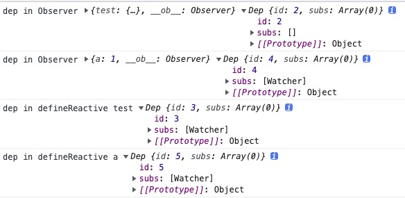
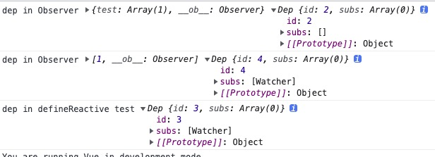

# `Observer`

我们在实例初始化的过程中，`initState`时调用了`initData(vm);`这个函数是初始化`vm.$options.data`响应式数据的方法。内部调用了`observe(data)`，因此了解`Observer`从`observe`函数开始。

## 1、`observe`函数

```js
function observe(value, asRootData) {
  if (!isObject(value) || value instanceof VNode) {
    return;
  }
  var ob;
  if (hasOwn(value, "__ob__") && value.__ob__ instanceof Observer) {
    ob = value.__ob__;
  } else if (
    shouldObserve &&
    !isServerRendering() &&
    (Array.isArray(value) || isPlainObject(value)) &&
    Object.isExtensible(value) &&
    !value._isVue
  ) {
    ob = new Observer(value);
  }
  if (asRootData && ob) {
    ob.vmCount++;
  }
  return ob;
}
```

这个函数主要是判断是否可以给`value`创建一个 `Observer`。如果存在那么返回已经存在的`ob`，否则新建一个新的`ob`。

在`initData`中，调用`observe(data)`传入第二个参数`asRootData = true`，意味着作为当前组件的根数据存在。

1. 如果传入的观察对象不是一个 **对象** 或者是一个**VNode**，直接返回`undefined`；这步确保传入的是可以观察的数据类型
2. 如果已经绑定过`__ob__`，并且`__ob__`是`Observer`的实例，那么`ob = value.__ob__`；这步确保避免多次观察
3. `shouldObserve = true`，并且不是 ssr，是一个纯对象或者数组，可以被拓展，不是 Vue 实例；那么`new Observer(value)`
4. 如果是根数据，`ob.vmCount++`，返回 ob。

## 2、`Observer`构造函数

```js
var arrayProto = Array.prototype;
var arrayMethods = Object.create(arrayProto);
var arrayKeys = Object.getOwnPropertyNames(arrayMethods);

var Observer = function Observer(value) {
  this.value = value;
  this.dep = new Dep();
  this.vmCount = 0;
  def(value, "__ob__", this);
  if (Array.isArray(value)) {
    if (hasProto) {
      protoAugment(value, arrayMethods);
    } else {
      copyAugment(value, arrayMethods, arrayKeys);
    }
    this.observeArray(value);
  } else {
    this.walk(value);
  }
};
```

每一个`Observer`都会定义一个`Dep`实例，使用`Object.defineProperty`给`value`定义一个`__ob__`属性指向`Observer`实例:

- 如果传入的对象是一个数组，调用`this.observeArray`，
- 如果是个对像，调用`this.walk`。

当传入的 value 是一个数组的时候，如果当前的浏览器支持`"__proto__" in {}`，使用`protoAugment`方法，否则使用`copyAugment`。（\***\*proto\*\***有更多的浏览器支持，并且是一个标准，未来有更多浏览器实现它，也可以使用`setPrototypeOf`）；

```js
/**
 * Augment a target Object or Array by intercepting
 * the prototype chain using __proto__
 */
function protoAugment(target, src) {
  target.__proto__ = src;
}

/**
 * Augment a target Object or Array by defining
 * hidden properties.
 */
/* istanbul ignore next */
function copyAugment(target, src, keys) {
  for (var i = 0, l = keys.length; i < l; i++) {
    var key = keys[i];
    def(target, key, src[key]);
  }
}
```

`protoAugment`修改`__proto__`来改变它的原型调用链，`copyAugment`是利用`Object.defineProperty`重新定义在`target`。

为啥改变它的原型方法呢，为了给重写数组的方法（会修改原数组的方法）如下：

```js
var methodsToPatch = [
  "push",
  "pop",
  "shift",
  "unshift",
  "splice",
  "sort",
  "reverse",
];
```

修改数组的方法的目的是可以在操作数组的时候，做一层拦截，在这个过程中做一些响应式操作，比如派发变更。

```js
/**
 * Intercept mutating methods and emit events
 * 拦截变异方法并发出事件
 */
methodsToPatch.forEach(function(method) {
  // cache original method
  var original = arrayProto[method];
  def(arrayMethods, method, function mutator() {
    var args = [],
      len = arguments.length;
    while (len--) args[len] = arguments[len];

    var result = original.apply(this, args);
    var ob = this.__ob__;
    var inserted;
    switch (method) {
      case "push":
      case "unshift":
        inserted = args;
        break;
      case "splice":
        inserted = args.slice(2);
        break;
    }
    if (inserted) {
      ob.observeArray(inserted);
    }
    // notify change
    ob.dep.notify();
    return result;
  });
});
```

还是执行`Array.prototype`的数组操作，产生的结果不做任何处理直接返回，但是会在返回前做一些消息派发的工作。另一个细节是判断是否是数组的插入操作（`push`、`unshift`、`splice`都可以向数组添加元素），插入操作需要给插入的数据重新添加响应式。最终触发当前数组的`dep.notify`。

### 2.1、`Observer`原型方法

```js
Observer.prototype.walk = function walk(obj) {};
Observer.prototype.observeArray = function observeArray(items) {};
```

### 2.2、`Observer.prototype.walk`

```js
Observer.prototype.walk = function walk(obj) {
  var keys = Object.keys(obj);
  for (var i = 0; i < keys.length; i++) {
    defineReactive$$1(obj, keys[i]);
  }
};
```

针对于 value 是一个对象，枚举所有的属性，对其进行响应式处理

### 2.3、`Observer.prototype.observeArray`

```js
Observer.prototype.observeArray = function observeArray(items) {
  for (var i = 0, l = items.length; i < l; i++) {
    observe(items[i]);
  }
};
```

针对于 value 是一个数组，遍历数组中的每一项，调用`observe`函数。

## 3、`defineReactive`函数（defineReactive\$\$1）

这个函数是 `Vue Observer`的核心，通过这个方法为对象创建响应式。

- `obj`：要处理的对象
- `key`：对象的属性名
- `val`：对象的值
- `customSetter`：自定义`setter`
- `shallow`：深层次观察

```js
function defineReactive(obj, key, val, customSetter, shallow) {
  var dep = new Dep();
  var property = Object.getOwnPropertyDescriptor(obj, key);
  if (property && property.configurable === false) {
    return;
  }
  // cater for pre-defined getter/setters
  var getter = property && property.get;
  var setter = property && property.set;
  if ((!getter || setter) && arguments.length === 2) {
    val = obj[key];
  }
  var childOb = !shallow && observe(val);
  Object.defineProperty(obj, key, {
    enumerable: true,
    configurable: true,
    get: function reactiveGetter() {},
    set: function reactiveSetter(newVal) {},
  });
}
```

`var dep = new Dep();`创建一个`Dep`；（闭包，外部无法直接访问这个`Dep`实例）。

```js
var property = Object.getOwnPropertyDescriptor(obj, key);
if (property && property.configurable === false) {
  return;
}
```

这段代码主要是获取`obj.key`的属性描述符`configurable`，只有当`configurable=true`的时候，该属性的描述符才可以改变，或者删除；所以这个属性描述符如果是`false`，之后的操作都是被禁止的，因此直接返回。

```js
// cater for pre-defined getter/setters
var getter = property && property.get;
var setter = property && property.set;
if ((!getter || setter) && arguments.length === 2) {
  val = obj[key];
}
```

这段代码缓存临时变量`getter`和`setter`，因为在下面的`reactiveGetter`和`reactiveSetter`中，如果`getter`函数是`undefined`，`obj[key]`需要使用`val`作为当前值，所以这里需要提前计算定义`val`。

```js
var childOb = !shallow && observe(val);
```

一般而言都需要深层次观察对象的响应式，所以再次调用 `observe(val)`，如果`val`是一个基本数据类型，那么会终止递归。比如：`Object.key(1)`返回一个空数组，即不会继续枚举下去。此处代码深度优先，子级对象的属性先处理响应式，比如：

```js
  data() {
    return {
      test: {
        a: 1,
      },
    };
  }
```

先处理`test:{...}`，遇到`observe(val)`再处理`{a: 1}`，`{a: 1}`完成之后，再继续处理`test:{...}`。

### 3.1、`reactiveGetter`函数

```js
function reactiveGetter() {
  var value = getter ? getter.call(obj) : val;
  if (Dep.target) {
    dep.depend();
    if (childOb) {
      childOb.dep.depend();
      if (Array.isArray(value)) {
        dependArray(value);
      }
    }
  }
  return value;
}
```

`reactiveGetter`主要进行依赖的收集

1. 如果存在`getter`那么调用`getter`获取`value`的值，否则使用`val`；
2. 确保`Dep.target`已经指向了一个`Watcher`实例，调用`dep.depend`，将访问当前闭包中的`Dep`实例，调用当前`Dep.target.addDep`方法，`Dep.target.addDep`方法中调用了`dep.addSub`，这样在`obj`的`key`属性存在一个`dep`可以获取到
   和它相关的`watcher`
3. 如果深入观察，那么也要调用`childOb.dep.depend()`
4. 如果当前的 value 是一个数组，那么调用`dependArray`。至此收集依赖完成。

例子：让我们来看下**渲染 watcher**到依赖收集的过程

```js
new Watcher(
  vm,
  updateComponent,
  noop,
  {
    before: function before() {
      if (vm._isMounted && !vm._isDestroyed) {
        callHook(vm, "beforeUpdate");
      }
    },
  },
  true /* isRenderWatcher */
);
```

首先我们要知道，**渲染`watcher`的实例化是在当前组件实例化过程的最后一步，此时代理、自定义事件、生命周期、数据、属性、注入都已经初始化完毕。**

当一个`Watcher`被`new`，内部会调用其原型链的方法`get`来计算 `value`，`get`首先调用`pushTarget`，指向当前的`watcher`，也就意味着之后的依赖收集都针对于当前的这个`watcher`；调用`getter`函数，在这里`getter`函数就是传入的`updateComponent`；`updateComponent`内部会调用`vm._render`，进而`touch`模板上的变量，从而触发`reactiveGetter`。

`reactiveGetter`判断`Dep.target`是否指向了一个`watcher`，调用`dep.depend`进行依赖的收集，（调用`watcher.addDep`，`watcher.addDep`中又调用了`dep.addSub`），这样在当前的`Dep`实例的`subs`属性添加了`watcher`，也在`watcher`的`newDeps`中添加了`dep`。

一个对象构建响应式会存在两个`Dep`实例：

- 通过给传入的对象添加`__ob__`属性去`new Observer`时`this.dep = new Dep()`；
- 调用`defineReactive`函数时创建一个`Dep`实例：`var dep = new Dep();`。

针对于下面简单的数据结构：

```js
  data() {
    return {
      test: {
        a: 1,
      },
    };
  },
  template: `<div>{{test}}</div>`,
```



可见位于数据最顶层的，定义在`Observer`实例中的`dep`没有进行依赖收集。(使用闭包的`Dep`收集依赖)

访问`test`时，调用`reactiveGetter`函数，触发`defineReactive`中闭包的`dep.depend`，接着调用`childOb.dep.depend`也就是`{a:1}`的`__ob__.dep.depend`；在 vue 模板输入对象，会展开这个对象。所以访问了`test.a`的`defineReactive`中闭包的`dep.depend`，由于其没有`childOb`，至此终止。

针对于数组的数据结构：

```js
 data() {
    return {
      test: [1],
    };
  },
  template: `<div>{{test}}</div>`,
```



数组可以看做是特殊的对象，数组的`index`作为对象的`key`

### 3.2、`reactiveSetter`函数

```js
function reactiveSetter(newVal) {
  var value = getter ? getter.call(obj) : val;
  /* eslint-disable no-self-compare */
  if (newVal === value || (newVal !== newVal && value !== value)) {
    return;
  }
  /* eslint-enable no-self-compare */
  if (customSetter) {
    customSetter();
  }
  // #7981: for accessor properties without setter
  if (getter && !setter) {
    return;
  }
  if (setter) {
    setter.call(obj, newVal);
  } else {
    val = newVal;
  }
  childOb = !shallow && observe(newVal);
  dep.notify();
}
```

`reactiveSetter`主要进行通知派发

1. 如果存在`getter`那么调用`getter`获取`value`的值，否则使用`val`；
2. 如果设置的值和步骤 1 获取的值一致，那么直接返回；（`newVal !== newVal && value !== value` NaN !== NaN）
3. 如果存在调用自定义`setter`，`customSetter`主要用作`warn`使用；
4. 如果`getter`存在但是`setter`不存在，直接返回；
5. 如果`setter`调用`setter`，否则 val = newVal；
6. 如果深入观察，深入观察内部值得变化；
7. 通知`dep`派发。
