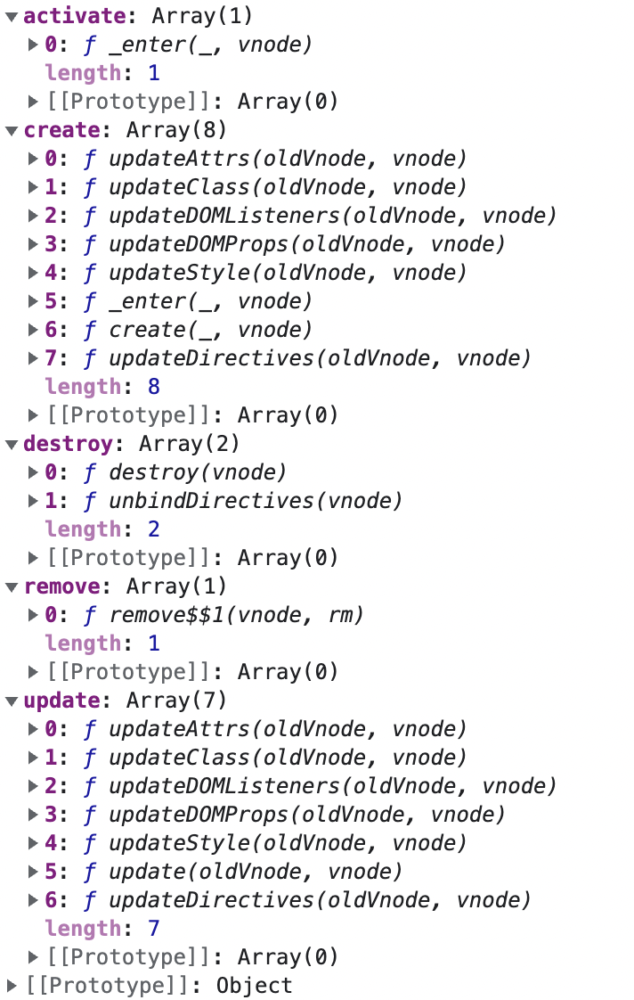
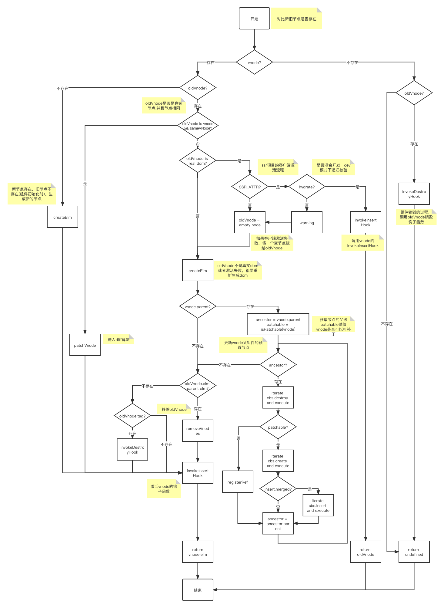

# patch

> diff 算法，ssr 客户端激活

通过前面的讨论，我们已经完成了`Vue`初始化，在`vm.$mount`之后，我们调用`vm._render`，最终执行的是`vm.__patch__`。`vm.__patch__`就是我们常说的 vdom 的 diff 算法，但实际上这只是 patch 方法中的一个分支，还有很多其他的逻辑。

## createPatchFunction

通过下面的代码我们可以得知，在浏览器端`vm.__patch__`通过`createPatchFunction`获得一个高阶函数。

```js
var patch = createPatchFunction({ nodeOps: nodeOps, modules: modules });
Vue.prototype.__patch__ = inBrowser ? patch : noop;
```

在`createPatchFunction`中，定义了大量的代码为 patch 函数构建服务，我们先看主要的逻辑。

### 什么是`nodeOps`?

`nodeOps`是一个真实节点操作的工具对象，使用了对象的冻结来保证一旦定义防止修改：

```js
var nodeOps = /*#__PURE__*/ Object.freeze({
  createElement: createElement$1, // 新建节点
  createElementNS: createElementNS,
  createTextNode: createTextNode, // 新建文本节点
  createComment: createComment, // 新建注释节点
  insertBefore: insertBefore, // 在指定的节点前插入
  removeChild: removeChild, // 移除节点
  appendChild: appendChild, // 在父节点的末尾添加节点
  parentNode: parentNode, // 访问其父节点
  nextSibling: nextSibling, // 下一个兄弟节点
  tagName: tagName, // tag的名称
  setTextContent: setTextContent, // 设置文本内容
  setStyleScope: setStyleScope, // node.setAttribute(scopeId, ""); 当样式添加了 scoped，会添加固定的属性 来增加样式选择器 权值
});
```

包括了在整个 patch 中用到的所有的工具方法：

- 新建元素、文本、注释节点
- 插入、移动、删除
- 父、兄弟节点的访问
- 文本设置
- 特殊的属性设置`data-v-xxxxx`

### 参数`modules`

modules 是一个数组，包含了以下对象，它的作用是注册 vnode 的生命周期函数，在关键的生命周节点，做新建、更新、销毁等操作。

```js
var platformModules = [attrs, klass, events, domProps, style, transition];
var modules = platformModules.concat(baseModules);
```

platformModules 定义的 vnode 的生命周期函数：

- `attrs`:定义在 create 和 update 的生命周期会更新属性
- `klass`:定义在 create 和 update 的函数会更新 class 样式
- `events`:定义在 create 和 update 的生命周期会更新事件
- `domProps`:定义在 create 和 update 的生命周期会更新 js 对象的属性
- `style`:定义在 create 和 update 的生命周期会更新内联样式
- `transition`:定义在 create、activate 和 remove 的生命周期会更新过度

```js
var attrs = {
  create: updateAttrs,
  update: updateAttrs,
};
var klass = {
  create: updateClass,
  update: updateClass,
};
var events = {
  create: updateDOMListeners,
  update: updateDOMListeners,
};
var domProps = {
  create: updateDOMProps,
  update: updateDOMProps,
};
var style = {
  create: updateStyle,
  update: updateStyle,
};
var transition = inBrowser
  ? {
      create: _enter,
      activate: _enter,
      remove: function remove$$1(vnode, rm) {
        /* istanbul ignore else */
        if (vnode.data.show !== true) {
          leave(vnode, rm);
        } else {
          rm();
        }
      },
    }
  : {};
```

baseModules 定义的生命周期的函数：

```js
var baseModules = [ref, directives];
```

- ref:
  - create：触发注册
  - update：重新绑定
  - destroy：销毁
- directives：
  - create，update：更新指令
  - destroy：销毁指令

```js
var ref = {
  create: function create(_, vnode) {
    registerRef(vnode);
  },
  update: function update(oldVnode, vnode) {
    if (oldVnode.data.ref !== vnode.data.ref) {
      registerRef(oldVnode, true);
      registerRef(vnode);
    }
  },
  destroy: function destroy(vnode) {
    registerRef(vnode, true);
  },
};
var directives = {
  create: updateDirectives,
  update: updateDirectives,
  destroy: function unbindDirectives(vnode) {
    updateDirectives(vnode, emptyNode);
  },
};
```

### hook 的集合 cbs

下面的代码意图维护一个以 hook 元素为 key 的集合：比如：`cbs.create = [xxx,...]`

```js
var hooks = ["create", "activate", "update", "remove", "destroy"];

function createPatchFunction(backend) {
  var i, j;
  var cbs = {};

  var modules = backend.modules;
  var nodeOps = backend.nodeOps;

  for (i = 0; i < hooks.length; ++i) {
    cbs[hooks[i]] = [];
    for (j = 0; j < modules.length; ++j) {
      if (isDef(modules[j][hooks[i]])) {
        cbs[hooks[i]].push(modules[j][hooks[i]]);
      }
    }
  }
  // ...很多代码
  return function patch(oldVnode, vnode, hydrating, removeOnly) {};
}
```

最终的数据结构如下图所示：



### 总结

到目前为止，我们分析了`createPatchFunction`函数的参数`nodeOps`和`modules`，并且知道了`cbs`的数据结构。`nodeOps`是一个操作 dom 的工具对象，而`modules`是属性、样式、事件、内容、styleScoped、过度、指令、ref 的生命周期函数的定义集合。指明一个 vnode 到真实 dom 的创建、更新、移动、销毁过程中，需要更新哪些维度的信息。

## patch(oldVnode, vnode, hydrating, removeOnly)

**第一部分：针对于新节点不存在，旧节点存在**

```js
function patch(oldVnode, vnode, hydrating, removeOnly) {
  // 第一部分代码
  if (isUndef(vnode)) {
    if (isDef(oldVnode)) {
      invokeDestroyHook(oldVnode);
    }
    return;
  }
  var isInitialPatch = false;
  var insertedVnodeQueue = [];
  // 后面的代码
  // ...
}
```

如果新节点不存在，旧节点存在，那么说明是一个卸载的过程，调用销毁的 hook:`invokeDestroyHook`

**第二部分：针对于新节点存在，旧节点不存在**

```js
function patch(oldVnode, vnode, hydrating, removeOnly) {
  // 第一部分代码
  // do something ...
  // 第二部分代码
  if (isUndef(oldVnode)) {
    // empty mount (likely as component), create new root element
    isInitialPatch = true;
    createElm(vnode, insertedVnodeQueue);
  }
  // 后面的代码
  // do something ...
}
```

如果新的节点存在，旧的节点不存在，那么是一个新建的过程：调用`createElm`

**第三部分：新旧节点都存在时**

```js
function patch(oldVnode, vnode, hydrating, removeOnly) {
  // 第一部分代码
  // do something ...
  // 第二部分代码
  if (isUndef(oldVnode)) {
    // do something ...
  } else {
    // 第三部分代码
    var isRealElement = isDef(oldVnode.nodeType);
    if (!isRealElement && sameVnode(oldVnode, vnode)) {
      patchVnode(oldVnode, vnode, insertedVnodeQueue, null, null, removeOnly);
    } else {
      // do something ...
    }
  }
  // 最后...
}
```

当`oldVnode`不是真实的 dom 元素，并且通过`sameVnode`函数比较一致，那么进入 diff 算法。反之，进入**新建或激活**的过程。首先来看下`sameVnode`的算法，也就是在什么情况会被判断为一个相同的节点：

```js
function sameVnode(a, b) {
  return (
    a.key === b.key &&
    ((a.tag === b.tag &&
      a.isComment === b.isComment &&
      isDef(a.data) === isDef(b.data) &&
      sameInputType(a, b)) ||
      (isTrue(a.isAsyncPlaceholder) &&
        a.asyncFactory === b.asyncFactory &&
        isUndef(b.asyncFactory.error)))
  );
}
```

以下两个条件必须符合：

- 具有相同的 key 值，**并且**
- 下面两个条件之一
  1. 相同的 tag 类型，都是或不是注释节点，都有 data 属性，如果是 tag 是 input 类型，他们 type 属性一致，**或**
  2. 异步组件并且指向相同的异步工厂函数，也就是同一个异步组件

总而言之，具有相同的 key 值，tag 类型一致，或者是同一个异步组件。

`patchVnode`函数就是 diff 算法的入口，vue vNode 的 diff 算法借鉴了`snabbdom`这个开源的虚拟 dom 库，我们之后会用一个章节来讲解整个过程，这里先跳过 diff 算法，看看 `else` 语句之中的逻辑：如果当前 oldValue 是一个 dom 元素，那么进入激活的过程，所谓的激活过程指的是 ssr 项目中，服务器端生成的 document 文档，会在客户端复用，vue 不再重新生成 dom 而是激活这些 dom，从而建立绑定的关系。

```js
if (isRealElement) {
  // mounting to a real element
  // check if this is server-rendered content and if we can perform
  // a successful hydration.
  if (oldVnode.nodeType === 1 && oldVnode.hasAttribute(SSR_ATTR)) {
    oldVnode.removeAttribute(SSR_ATTR);
    hydrating = true;
  }
  if (isTrue(hydrating)) {
    if (hydrate(oldVnode, vnode, insertedVnodeQueue)) {
      invokeInsertHook(vnode, insertedVnodeQueue, true);
      return oldVnode;
    } else {
      warn(
        "The client-side rendered virtual DOM tree is not matching " +
          "server-rendered content. This is likely caused by incorrect " +
          "HTML markup, for example nesting block-level elements inside " +
          "<p>, or missing <tbody>. Bailing hydration and performing " +
          "full client-side render."
      );
    }
  }
  // either not server-rendered, or hydration failed.
  // create an empty node and replace it
  oldVnode = emptyNodeAt(oldVnode);
}
```

`SSR_ATTR`变量的定义：`var SSR_ATTR = "data-server-rendered"`

如果节点是一个元素的节点，并且存在`data-server-rendered`属性，删除`SSR_ATTR`属性，并且标记`hydrating = true`，之后会通过这个标识来判断是否激活客户端。详细的内容在https://ssr.vuejs.org/zh/guide/hydration.html。

通过`hydrate(oldVnode, vnode, insertedVnodeQueue)`这个函数来判断是否需要去激活，如果返回`true`,调用`invokeInsertHook`实现激活，并且返回整个旧节点，完成整个的`patch`过程。否则会有一个警告，告诉开发者激活失败。一般造成这个问题的原因，除了上面说到的标签标准化的问题，还有可能存在不通用的、带有副作用的代码。比如一个参与渲染的随机函数造成 dom 不一致。

激活没有成功，或者非 ssr 项目，都会将 oldVnode(这里是一个真实的 dom 对象) 作为 `elm` 会被挂载在一个空的 vnode 上。

除了 **ssr 项目并且激活成功**的情况之外，都会走到下面的逻辑：

```js
// replacing existing element
var oldElm = oldVnode.elm;
var parentElm = nodeOps.parentNode(oldElm);

// create new node
createElm(
  vnode,
  insertedVnodeQueue,
  // extremely rare edge case: do not insert if old element is in a
  // leaving transition. Only happens when combining transition +
  // keep-alive + HOCs. (#4590)
  oldElm._leaveCb ? null : parentElm,
  nodeOps.nextSibling(oldElm)
);
```

从这里开始，vue 开始创建应用的真实 dom。`patchVnode`的前提是`oldVnode`不是一个真实的 dom 元素节点，并且和 vnode 有着相同的“类型”（满足于 sameVnode 函数）。例如：我们的应用根节点是`div#app`，oldElm 是当前应用的根节点，parentElm 是`div#app`的父节点（如`body`节点）。接下来调用`createElm`创建了当前组件的真实的 dom 节点，并将结果保存在了`vnode.elm`中。

应用的真实的 dom 已经构建成功了，针对于子组件，下面我们来更新父组件中的预置节点，针对于下面的场景：

```js
const child = Vue.extend({
  data() {
    return {
      a: 1,
    };
  },
  mounted() {
    this.a = 0;
  },
  render(h) {
    return this.a ? h("div", 1) : h("span", 2);
  },
});
const app = new Vue({
  el: "#app",
  components: {
    child,
  },
  render(h) {
    return h("child");
  },
});
```

当子组件的根节点依赖于变量`a`的值，并且根节点不满足 someVnode 的时候，走入下面的代码。目的是更新父级的预置节点。

```js
// 更新父组件中的预置节点，前提的条件是父组件存在;
// var emptyNode = new VNode("", {}, []);
if (isDef(vnode.parent)) {
  var ancestor = vnode.parent;
  var patchable = isPatchable(vnode);
  while (ancestor) {
    // 执行祖先的销毁方法，销毁当前 ref 和 指令
    for (var i = 0; i < cbs.destroy.length; ++i) {
      cbs.destroy[i](ancestor);
    }
    ancestor.elm = vnode.elm;
    if (patchable) {
      for (var i$1 = 0; i$1 < cbs.create.length; ++i$1) {
        // 新建 class，css，......
        cbs.create[i$1](emptyNode, ancestor);
      }
      // #6513
      // invoke insert hooks that may have been merged by create hooks.
      // e.g. for directives that uses the "inserted" hook.
      // 特殊的处理 inserted
      var insert = ancestor.data.hook.insert;
      if (insert.merged) {
        // start at index 1 to avoid re-invoking component mounted hook
        for (var i$2 = 1; i$2 < insert.fns.length; i$2++) {
          insert.fns[i$2]();
        }
      }
    } else {
      registerRef(ancestor);
    }
    ancestor = ancestor.parent;
  }
}
```

一个 vnode 是否可以打补丁呢？isPatchable 函数的逻辑如下：

```js
// 是否可以打补丁
function isPatchable(vnode) {
  // vnode.componentInstance指向当前vnode绑定的组件实例
  // 如果当前节点存在 组件实例，
  while (vnode.componentInstance) {
    vnode = vnode.componentInstance._vnode;
  }
  return isDef(vnode.tag);
}
```

通过判断`vnode.componentInstance._vnode`的 tag 是否存在，`vnode.componentInstance`指向当前的 vm 实例，`vm._vnode`指的是当前根节点。

上面代码触发的场景是：组件的根节点发生变化的时候，并且`sameVnode`返回 false，组件 vnode 的`parent`即不为空，这是一个递归逻辑，查找 vnode 的父级，调用`destroy hook`。销毁 vnode 父级的节点；这是为了销毁之前祖先节点，释放内存。然后通过`create`新建一个祖先。如果可以打补丁，调用`create hook`，调用`ancestor`的`insert cb`；如果不需要打补丁，调用`registerRef`函数。
最终如果 parentElm 存在，使用`removeVnodes`函数移除 oldVnode，或者 oldVnode.tag 存在，使用`invokeDestroyHook`销毁 oldVnode。

```js
// destroy old node
if (isDef(parentElm)) {
  removeVnodes([oldVnode], 0, 0);
} else if (isDef(oldVnode.tag)) {
  invokeDestroyHook(oldVnode);
}
```

最终调用`invokeInsertHook(vnode, insertedVnodeQueue, isInitialPatch); `激活 vnode 并返回 vnode.elm。

综上所有，`patch`的逻辑图为：


## invokeDestroyHook

## createElm

## registerRef

对于同步的子组件的构建触发点 在于 createPatchFunction 的 createComponent 函数（在 patch 阶段）， vnode 的 hook 里面，init 钩子会去触发构建 vnode 的 vm 实例，并且挂载；

对于异步的子组件的构建出发点 在于\_createElemnet 的 createComponent 函数（在 render 阶段声明的微任务）， 调用了 resolveAsyncComponent 函数，微任务中执行渲染 watcher 的强制更新，实现异步组件替换注释节点，实现挂载
